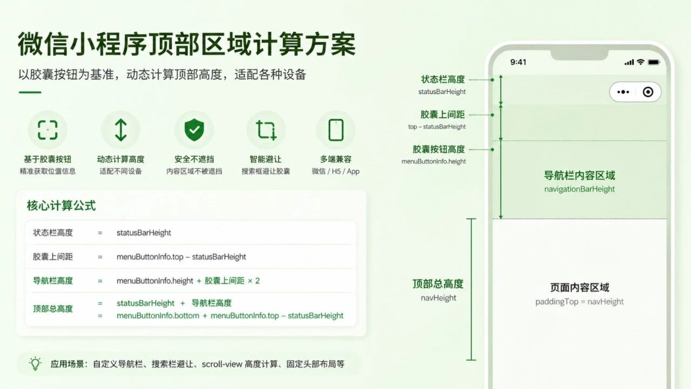

```js
export function getNavInfo() {
  const systemInfo = uni.getSystemInfoSync()

  const statusBarHeight = systemInfo.statusBarHeight || 0
  const windowWidth = systemInfo.windowWidth
  const windowHeight = systemInfo.windowHeight

  let navigationBarHeight = 44
  let navHeight = statusBarHeight + navigationBarHeight
  let menuButtonInfo = null
  let menuAvoidWidth = 0
  let rightGap = 0

  // #ifdef MP-WEIXIN
  try {
    menuButtonInfo = uni.getMenuButtonBoundingClientRect()

    navigationBarHeight =
      menuButtonInfo.height + (menuButtonInfo.top - statusBarHeight) * 2

    navHeight = statusBarHeight + navigationBarHeight

    rightGap = windowWidth - menuButtonInfo.right
    menuAvoidWidth = windowWidth - menuButtonInfo.left // 右侧胶囊位置宽度，再+10为左侧内容与右侧胶囊中间距离
  } catch {
    navigationBarHeight = 44
    navHeight = statusBarHeight + navigationBarHeight
  }
  // #endif

  // #ifndef MP-WEIXIN
  if (systemInfo.platform === 'android') {
    navigationBarHeight = 50
  } else {
    navigationBarHeight = 45
  }

  navHeight = statusBarHeight + navigationBarHeight
  // #endif

  return {
    systemInfo,
    menuButtonInfo,

    statusBarHeight,
    navigationBarHeight,
    navHeight,

    windowWidth,
    windowHeight,

    rightGap,
    menuAvoidWidth
  }
}
```

