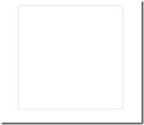
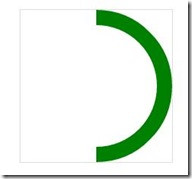
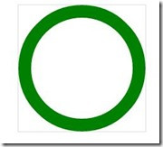
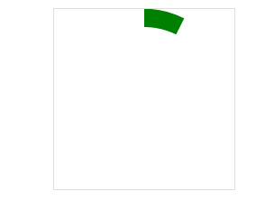

完整html
```
.timer-group {
            position: relative;
            width: 13.05rem;
            height: 13.05rem;
            margin: 2.95rem auto 0;
            border-radius: 50%;
            box-shadow: 0 0 .65rem rgba(39, 62, 129, 0.25);
        }
        
        <div class="timer-group">
            <div class="time-wrapper">
                <div class="wrapper Pright">
                    <div class="circleProgress rightcircle"></div>
                </div>
                <div class="wrapper Pleft">
                    <div class="circleProgress leftcircle"></div>
                </div>
            </div>
            <div class="time-center">
                <div class="time-num pingfangRegular">00:00:00</div>
            </div>
        </div>
```


`1rem = 20px;`<br />

1. 我们先设置一个12.25rem*12.45rem的方块，然后我们在这里面完成我们的效果： 

   ```
   .time-wrapper {
               position: absolute;
               top: 0;
               right: 0;
               bottom: 0;
               left: 0;
               width: 12.25rem;
               height: 12.25rem;
               line-height: 10.05rem;
               margin: auto;
               /*变不变圆角随意*/
               border-radius: 50%;
               /*box-shadow: 0 0 .65rem rgba(39, 62, 129, 0.25);*/
           }
   ```

   

   2. 接下来我将在这个容器里再放两个矩形，每个矩形都占一半： 

      ```
      .time-wrapper .wrapper {
                  position: absolute;
                  top: 0;
                  width: 6.125rem;
                  height: 12.25rem;
                  overflow: hidden;
              }
      
              .time-wrapper .Pright {
                  right: 0;
              }
      
              .time-wrapper .Pleft {
                  left: 0;
              }
      ```

      

`这里重点说一下.wrapper 的overflow:hidden; 起着关键性作用。这两个矩形都设置了溢出隐藏，那么当我们去旋转矩形里面的圆形的时候，溢出部分就被隐藏掉了，这样我们就可以达到我们想要的效果。 `

3. 从html结构也已看到，在左右矩形里面还会各自有一个圆形： 

 ```
.circleProgress {
            position: absolute;
            top: 0;
            width: 12.25rem;
            height: 12.25rem;
            border: .5rem solid transparent;
            border-radius: 50%;
            box-sizing: border-box;
        }

        .rightcircle {
            right: 0;
            border-top: .5rem solid #363292;
            border-right: .5rem solid #363292;
        }

        .leftcircle {
            left: 0;
            border-bottom: .5rem solid #363292;
            border-left: .5rem solid #363292;
        }
   
 ```

.jpg)

4. 可以看到，效果已经出来了，其实本来是一个半圆弧，但由于设置了上边框和右边框，所以上边框有一半溢出而被隐藏了，所以我们可以通过旋转得以还原： 在`.circleProgress `加上`-webkit-transform: rotate(45deg);  `
  

5. 加上左边

  

  

6. 紧接着，就是让它动起来，原理是这样的， 先让右半圆弧旋转180度，再让左半圆弧旋转180度 ，这样，两个半圆弧由于先后都全部溢出而消失了，所以看起来就是进度条再滚动的效果： 

   `.rightcircle `加上`-webkit-animation: circleProgressLoad_right 5s linear infinite`,`.leftcircle `加上`-webkit-animation: circleProgressLoad_left 5s linear infinite; `

   ```
   @-webkit-keyframes circleProgressLoad_right{   
     0%{   
       -webkit-transform: rotate(45deg);   
     }   
     50%,100%{   
       -webkit-transform: rotate(225deg);   
     }   
   }   
   @-webkit-keyframes circleProgressLoad_left{   
     0%,50%{   
       -webkit-transform: rotate(45deg);   
     }   
     100%{   
       -webkit-transform: rotate(225deg);   
     }   
   }  
   ```

   

   

   

7. 只需要调整一下角度就可以实现反向的效果： 

```
@-webkit-keyframes circleProgressLoad_right {
            0% {
                -webkit-transform: rotate(-135deg);
            }
            50%,
            100% {
                -webkit-transform: rotate(45deg);
            }
        }

        @-webkit-keyframes circleProgressLoad_left {
            0%,
            50% {
                -webkit-transform: rotate(-135deg);
            }
            100% {
                -webkit-transform: rotate(45deg);
            }
        }
```

`.circleProgress `改为`-webkit-transform: rotate(-135deg); `

