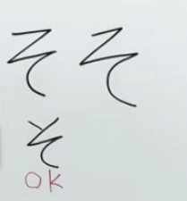

# 基础

## 五十音

|      |  a   |  i   |  u   |  e   |  o   |
| :--: | :--: | :--: | :--: | :--: | :--: |
|      |  あ  |  い  |  う  |  え  |  お  |
|  k   |  か  |  き  |  く  |  け  |  こ  |
|  s   |  さ  |  し  |  す  |  せ  |  そ  |
|  t   |  た  |  ち  |  つ  |  て  |  と  |
|  n   |  な  |  に  |  ぬ  |  ね  |  の  |
|  h   |  は  |  ひ  |  ふ  |  へ  |  ほ  |
|  m   |  ま  |  み  |  む  |  め  |  も  |
|  y   |  や  |  \   |  ゆ  |  \   |  よ  |
|  r   |  ら  |  り  |  る  |  れ  |  ろ  |
|  w   |  わ  |  \   |  \   |  \   |  を  |

### 清音

**平假名（ひらがな）**

**片假名（かたかな）**

### 浊音

### 拗音

**注意：**

* sa、ki：印刷体さ　书写：弯位置不连笔
* so：手写两种都可以，用标着ok的写法吧
	
* wo：念o就好，很少用

## 键盘如何输入

* 长音**‘ー’**：数字键0右边的减号键ー

* 拨音**‘ん’**：连续输入两次字母n

* 促音**‘っ’**：

* 例如单词永远：ずっと，输入法为zutto，所以输入时只需要把促音后面的と（to）这一假名

  的声母（t）输入两遍即可。

* 小型字：在它之前加上字母‘X’即可

* 片假名：mac：平假名打出（未选择时）按<kbd>F7</kbd>

# 大家的日语