## **八卦图**

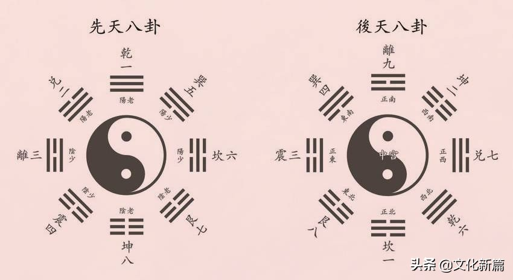

## 阴阳五行

### 五行特性

木指东方主仁，特征：绿色、生长、柔和、温暖、早晨、春天、植物等信息；

火指南方主礼，特征：红色、炎热、光芒、升腾、夏天、消息、急、炎热、热心肠、脾气火爆等‘

金指西方主义，特征：白色、清凉、肃杀、收敛、金属、秋天、公检法等；

水指北方主智，特征：黑色、寒冷、潮湿、冰霜、冬天等；

土指中间主信，特征：黄色、包容、养育、四季、中央等。

### 五行生克

五行相生：木→火→土→金→水→木

五行相克：木→土→水→火→金→木

### 五行与四季

春天五行属木，夏天五行属火，秋天五行属金，冬天五行属水。土是每个季节的最后一个月，即辰月、未月、戌月、丑月。

> 河图数：天1生水，地6成枝，木3、8，火2、7，金4、9，土5、10

## 八卦

乾☰、坤☷、离☲、坎☵、兑☱、巽☴、震☳、艮☶

太阳⚌、少阴⚍、少阳⚎、太阴⚏

阳⚊ 、阴⚋

**八卦卦象口诀**：乾三连、坤六断、离中虚、坎中满、兑上缺、巽下断、震仰盂、艮覆碗

**先天数**：乾1、兑2、离3、震4、巽5、坎6、艮7、坤8

**八卦象意**

|        |           乾           |          兑          |            离            |      震      |             巽             |               坎               |              艮              |          坤          |
| :----: | :--------------------: | :------------------: | :----------------------: | :----------: | :------------------------: | :----------------------------: | :--------------------------: | :------------------: |
|  符号  |           ☰            |          ☱           |            ☲             |      ☳       |             ☴              |               ☵                |              ☶               |          ☷           |
|  自然  |           天           |          泽          |            火            |      雷      |             风             |               水               |              山              |          地          |
|  五行  |           金           |          金          |            火            |      木      |             木             |               水               |              土              |          土          |
|  阴阳  |           阳           |          阴          |            阴            |      阳      |             阴             |               阳               |              阳              |          阴          |
| 先天数 |           1            |          2           |            3             |      4       |             5              |               6                |              7               |          8           |
|  方位  |          西北          |          西          |            南            |      东      |            东南            |               北               |             东北             |         西南         |
|  纳干  |          甲壬          |          丁          |            己            |      庚      |             辛             |               戊               |              丙              |         乙癸         |
|  颜色  |          金黄          |          白          |            红            |      绿      |           绿、蓝           |               黑               |             咖啡             |          黄          |
|  五味  |           辣           |          辣          |            苦            |      酸      |             酸             |               咸               |              甜              |          甜          |
|  人体  |           头           |          口          |            眼            |      足      |             股             |               耳               |              手              |          腹          |
|  脏腑  |          大肠          |          肺          |           心脏           |      肝      |             胆             |               肾               |              脾              |          胃          |
|  病象  | 老病、急病、硬化性疾病 | 外伤、血压低、皮肤病 | 烫伤、发烧、血液、妇科病 | 多动症、外伤 | 感冒、中风、忧郁症、传染病 | 性病、中毒、水肿病、免疫系统病 | 肿瘤、结石、皮肤病、气血不通 | 浮肿、皮肤病、慢性病 |

> “物以稀为贵”，哪个爻少，阴阳就是哪个。例如兑：阴爻1个，阳爻两个，所以为阴

### 六十四卦

|          |  八纯卦  |                |                |              |                |                | 游魂卦     | 归魂挂     |
| :------: | :------: | :------------: | :------------: | :----------: | :------------: | :------------: | ---------- | ---------- |
| 乾宫八卦 | ䷀乾为天 | ䷫天风姤(gòu)  |    ䷠天山遁    | ䷋天地否(pǐ) | ䷓风地观(guān) |  ䷖山地剥(bō)  | ䷢火地晋   | ䷍火天大有 |
| 坎宫八卦 | ䷜坎为水 |    ䷻水泽节    | ䷂水雷屯(zhūn) |  ䷾水火既济  |    ䷰泽火革    |    ䷶雷火丰    | ䷣地火明夷 | ䷆地水师   |
| 艮宫八卦 | ䷳艮为山 |  ䷕山火贲(bì)  | ䷙山天大畜(xù) |   ䷨山泽损   | ䷥火泽睽(kuí)  |    ䷉天泽履    | ䷼风泽中孚 | ䷴风山渐   |
| 震宫八卦 | ䷲震为雷 |    ䷏雷地豫    |    ䷧雷水解    |   ䷟雷风恒   |    ䷭地风升    |    ䷯水风井    | ䷛泽风大过 | ䷐泽雷随   |
| 巽宫八卦 | ䷸巽为风 | ䷈风天小畜(xù) |   ䷤风火家人   |   ䷩风雷益   |   ䷘天雷无妄   | ䷔火雷噬嗑(hé) | ䷚火雷颐   | ䷑山风蛊   |
| 离宫八卦 | ䷝离为火 |    ䷷火山旅    |    ䷱火风鼎    |  ䷿火水未济  |    ䷃山水蒙    | ䷺风水涣(huàn) | ䷅天水讼   | ䷌天火同人 |
| 坤宫八卦 | ䷁坤为地 |    ䷗地雷复    |    ䷒地泽临    |   ䷊地天泰   |   ䷡雷天大壮   | ䷪泽天夬(guài) | ䷄水天需   | ䷇水地比   |
| 兑宫八卦 | ䷹兑为泽 |    ䷮泽水困    |    ䷬泽地萃    |   ䷞泽山咸   | ䷦水山蹇(jiǎn) |    ䷎地山谦    | ䷽雷山小过 | ䷵雷泽归妹 |

排列规则：第一列上下卦一致，由本卦宫的卦象组合而成，此八个卦称为八纯卦。第二至六列，从初爻到五爻依次变化。第七个，规定最多变到五爻，不能全变，所以要变四爻，称为游魂卦。第八个，下卦变为本卦宫的卦象，称为归魂卦。

## 十二地支与生克

**十二地支**：子（11月）（23点-1点）、丑（12月）（1-3）、寅（1月）（3-5）、卯（2月）（5-7）、辰（3月）（7-9）、巳（4月）（9-11）、午（5月）（11-13）、未（6月）（13-15）、申（7月）（15-17）、酉（8月）（17-19）、戌（9月）（19-21）、亥（10月）（21-23）

**六阳支**：子、寅、辰、午、申、戌

**六阴支**：亥、酉、未、巳、卯、丑

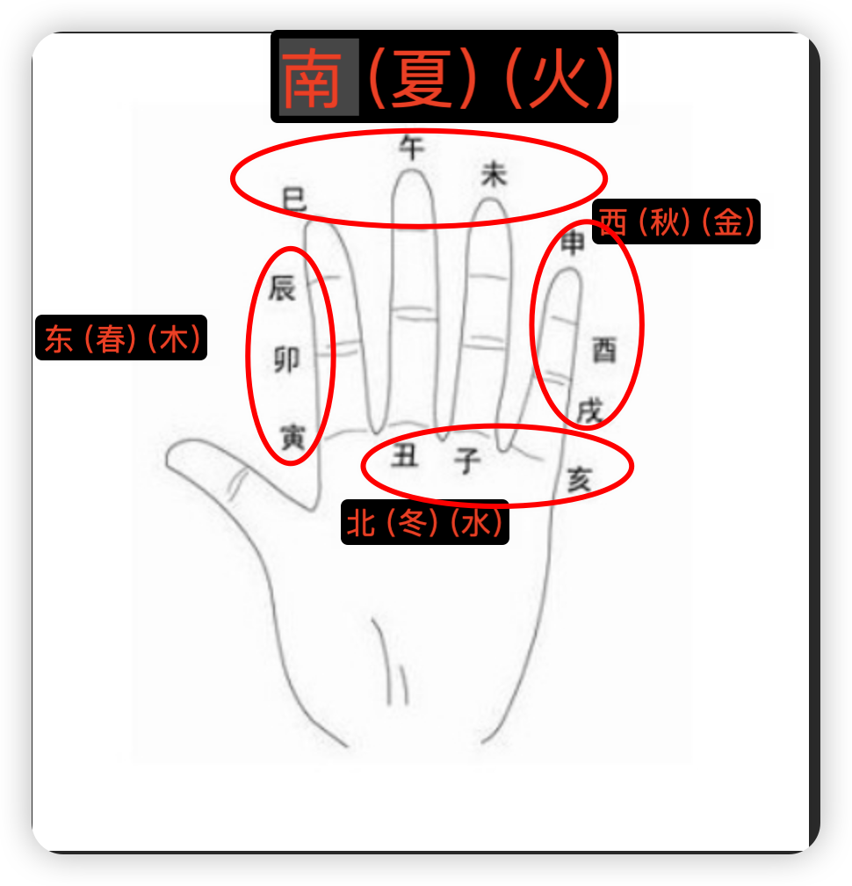

**地支口诀**：（甲乙）东方寅卯木，（丙丁）南方巳午火，（戊己中央土），（庚辛）西方申酉金，（壬癸）北方亥子水，辰戌丑未土

> 一年有四季，每个季节三个月，“土藏于四季”，季末为土（辰未戌丑）

### 六冲和六合

**地支六合**：代表和好、合作、缠绵、长久的意思，六合也为夫妻之道。分别为：子丑合，寅亥合，卯戌合，辰酉合，巳申合，午未合

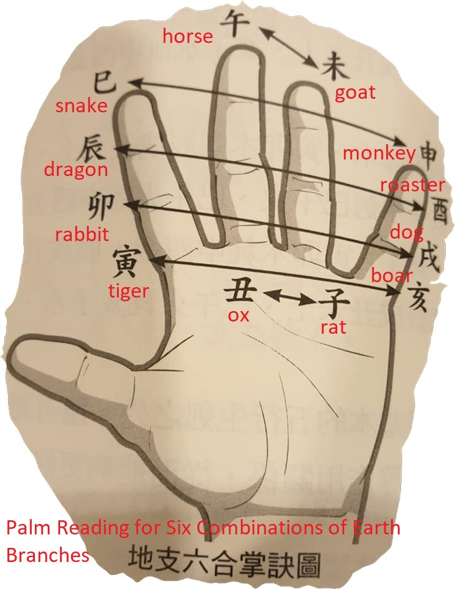

**地支六冲**：代表对立、战斗、冲突、争执、敌意、冲散的意思。分别为：丑未冲、子午冲、巳亥冲、辰戌冲、卯酉冲、寅申冲

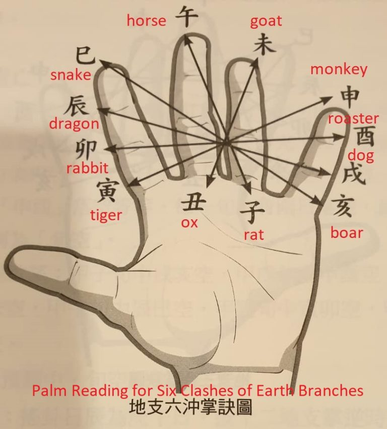

## 起卦与纳甲

### 起卦方法

1. 以三枚铜钱或硬币
2. 带字一面为阴（正）也叫字，带花或符号一面为阳（反）也叫背
3. 把三枚铜钱放在手中或盒子中，心里默想所要问的事情，摇晃数次，撒于桌上火地上，如此掷6次。装挂时**从下往上**。

三个铜钱会出现以下情况：1字2花记阴爻，2字1花为阳爻，3花为阳极记作阳动爻，以圆圈○为标记；3字为阴极记作阴动爻，以叉为标记✕，其他爻为静爻

第一次记录再最下面的叫做初爻，一次往上记为二爻、三爻、四爻、五爻、六爻，然后成卦

成卦后的挂为**主卦**，根据变爻生成的卦为变卦

下面的八卦为下卦也叫内卦，上面的是上卦也叫外卦

### 多种起卦方式

1. 求测人手摇卦
2. 网上或电话求测，预测时可以代摇（最好对面摇）
3. 可以翻书取卦，事先想好事翻书那一页的数字，连续翻两次，得两个数，用第一个数除8得余数为上卦，第二个数除8得余数为下卦，再把两个数相加后除6余数为动爻数。（1.a%8;2.b%8;3.(a+b)%6）（%为取余（javascript））
4. 报双数起卦（与3计算方式相同）
5. 报汉字取卦（汉字的笔画+时辰）：比如午未，戌时，上卦为4下卦为5雷风恒卦，戌是11，4+5+11=20，20%6=2，则二爻动，可以用安卓软件：da8da8da
6. 直接软件起卦（溜溜好运、天机六爻）

### 纳甲

**八卦纳甲歌诀**：

乾**内**甲子**外**壬午，坎**内**戊寅**外**戊申。

艮**内**丙辰**外**丙戌，震**内**庚子**外**庚午。

巽**内**辛丑**外**辛未，离**内**己卯**外**己酉。

坤**内**乙未**外**癸丑，兑**内**丁巳**外**丁亥。

> 乾坎艮震为四阳挂，巽离坤兑为四阴卦
>

**装挂**：将卦分为上（外）下（内）卦，根据[八卦纳甲歌诀](#纳甲)，将初爻和四爻装上天干地支，其余爻根据掌盘填写，天干不变。四阳卦按地支**顺时针**纳甲，四阴挂按照地支**逆时针**纳甲，**中间必须要隔一个地支**

**例1**：火天大有

离外 ⚊ 己巳

阴逆 ⚋ 己未

​        ⚊ 己酉（离外己酉）

乾内 ⚊ 甲辰

阳顺 ⚊ 甲寅

​        ⚊ 甲子（乾内甲子）

## 安世应、寻[卦宫](#六十四卦)

安世应也可以叫做寻世应，寻找世爻和应爻。世爻代表求测人，应爻代表求测人所处的环境，也可以代表他人他事

### 安世应歌诀

天同二世天变五

地同四世地变初

人同游魂人变归

全同六世全变三

**解释**：

“同”是相同的意思，“变”就是不同的意思。归指的是归魂卦。其中数字和初代表爻位。全代表上下卦的天人地爻都相同，为全同，例如[八纯卦](#六十四卦)

上（外）下（内）卦从上往下分别为天爻、人爻、地爻

此歌诀定位世爻的位置，应爻在世爻所对应上/下挂的天人地爻的位置；

**游魂卦世爻永远在四爻，归魂卦世爻永远在三爻**

例：天风姤卦

上卦 天 ⚊

​        人 ⚊

​        地 ⚊

下卦 天 ⚊

​        人 ⚊

​        地 ⚋

天同（天爻相同），人同（人爻相同），**地不同**（地爻不相同）。根据“物以稀为贵”原则，不同的有一个，所以找地相关的歌诀，所以应用歌诀，世爻在初爻位置，应爻在四爻的位置（下卦地爻对应上爻地爻）

### 寻卦宫口诀

一二三六外挂宫

四五游魂内变更

归魂内卦是本宫

一个三四五六为世爻所在位置。世爻在一二三六爻位置，则外卦（上卦）为卦宫。四五爻及游魂卦卦宫由内卦（下卦）确定，且需要内卦**所有爻由阴变阳/阳变阴**，变化后的卦象为所在卦宫。

例：水天需卦

⚋

⚊

⚋ 世

⚊

⚊

⚊ 应

天不同，人同，地不同。所以此卦为游魂卦，世爻在四爻，应爻对世爻位置在初爻。游魂卦看内卦，内卦由乾卦变化为坤卦，所以卦宫为坤宫。

## 六亲

指**父母、子孙、官鬼、妻财、兄弟**五类象征性的名词。这五类与卦身合在一起，总称六亲。确定六亲以该卦所在宫的五行属性为**我**，以卦中各爻（地支）的五行属性为他，看他和我的生克关系。

按照**“生我者父母，我生者子孙，克我者官鬼，我克者妻财，相同者兄弟”**的规则来确定每爻是何六亲。变卦的六亲排布按照**主卦的卦宫的五行**，进行六亲排布。

#### 六亲的生克关系：

相生：子孙-妻财-官鬼-父母-兄弟-子孙

相克：子孙-官鬼-兄弟-妻财-父母-子孙

#### 八纯卦六亲

为了方便找伏神，列出装好六亲的八纯卦

##### 乾宫（金）

|    乾为天    |      |      |
| :----------: | :--: | :--: |
| 父母 壬戌 土 |  ⚊   |  世  |
| 兄弟 壬申 金 |  ⚊   |      |
| 官鬼 壬午 火 |  ⚊   |      |
| 父母 甲辰 土 |  ⚊   |  应  |
| 妻财 甲寅 木 |  ⚊   |      |
| 子孙 甲子 水 |  ⚊   |      |

##### 兑宫（金）

|    兑为泽    |      |      |
| :----------: | :--: | :--: |
| 父母 丁未 土 |  ⚋   |  世  |
| 兄弟 丁酉 金 |  ⚊   |      |
| 子孙 丁亥 水 |  ⚊   |      |
| 父母 丁丑 土 |  ⚋   |  应  |
| 妻财 丁卯 木 |  ⚊   |      |
| 官鬼 丁巳 火 |  ⚊   |      |

##### 离宫（火）

|    离为火    |      |      |
| :----------: | :--: | :--: |
| 兄弟 己巳 火 |  ⚊   |  世  |
| 子孙 己未 土 |  ⚋   |      |
| 妻财 己酉 金 |  ⚊   |      |
| 官鬼 己亥 水 |  ⚊   |  应  |
| 子孙 己丑 土 |  ⚋   |      |
| 父母 己卯 木 |  ⚊   |      |

##### 震宫（木）

|    震为雷    |      |      |
| :----------: | :--: | :--: |
| 妻财 庚戌 土 |  ⚋   |  世  |
| 官鬼 庚申 金 |  ⚋   |      |
| 子孙 庚午 火 |  ⚊   |      |
| 妻财 庚辰 土 |  ⚋   |  应  |
| 兄弟 庚寅 木 |  ⚋   |      |
| 父母 庚子 水 |  ⚊   |      |

##### 巽宫（木）

|    巽为风    |      |      |
| :----------: | :--: | :--: |
| 兄弟 辛卯 木 |  ⚊   |  世  |
| 子孙 辛巳 火 |  ⚊   |      |
| 妻财 辛未 土 |  ⚋   |      |
| 官鬼 辛酉 金 |  ⚊   |  应  |
| 父母 辛亥 水 |  ⚊   |      |
| 妻财 辛丑 土 |  ⚋   |      |

##### 坎宫（水）

|    坎为水    |      |      |
| :----------: | :--: | :--: |
| 兄弟 戊子 水 |  ⚋   |  世  |
| 官鬼 戊戌 土 |  ⚊   |      |
| 父母 戊申 金 |  ⚋   |      |
| 妻财 戊午 火 |  ⚋   |  应  |
| 官鬼 戊辰 土 |  ⚊   |      |
| 子孙 戊寅 木 |  ⚋   |      |

##### 艮宫（土）

|    艮为山    |      |      |
| :----------: | :--: | :--: |
| 官鬼 丙寅 木 |  ⚊   |  世  |
| 妻财 丙子 水 |  ⚋   |      |
| 兄弟 丙戌 土 |  ⚋   |      |
| 子孙 丙申 金 |  ⚊   |  应  |
| 父母 丙午 火 |  ⚋   |      |
| 兄弟 丙辰 土 |  ⚋   |      |

##### 坤宫（土）

|    坤为地    |      |      |
| :----------: | :--: | :--: |
| 子孙 癸酉 金 |  ⚋   |  世  |
| 妻财 癸亥 水 |  ⚋   |      |
| 兄弟 癸丑 土 |  ⚋   |      |
| 官鬼 乙卯 木 |  ⚋   |  应  |
| 父母 乙巳 火 |  ⚋   |      |
| 兄弟 乙未 土 |  ⚋   |      |

# 理法篇

## 用神

用神：求什么，相应宫就是**用神**，比如求事业，则官鬼爻为用神。

原神：**生**用神的为原神。也为吉利之神，原神发动吉，说明所测之事有能量，可以保持相对长久。

忌神：**克**用神的为忌神。忌神是不利于用神的因素，忌神发动，代表事情凶。

仇神：**克**原神、**生**忌神的为仇神。排盘时直接看克原神就好。仇神不是直接作用用神的，而是通过原神和忌神得以间接体现，所以事情多应在长远。仇神有助纣为虐的象，故多为不吉。

**只标注主卦**

**用神只能有一个，其他神可以有多个，仇神可以没有**

> 没有用神称为伏藏

### 用神多现

多个用神称为用神多现。确定哪个是用神：

1. 优先取[世应爻位置][2]的为用神
2. 取动爻或[暗动][11]之爻为用神。（用神不在世应爻位置上时）。
3. 有异取异常为用神，如临月、临日、月合、日合、月冲、日冲或空亡、入墓的本卦爻为用神
4. 本卦中没有用神时，取[伏神][7]为用神

> 都不符合或者多个符合爻根据卦中的显示取用神，例：[卦主母亲脑梗，问什么时候能好，现在嘴歪说话不清楚](#卦主母亲脑梗，问什么时候能好，现在嘴歪说话不清楚)

例：主卦泽地萃，变卦雷地豫

​    ⚋ 丁未 土 父母

应 ⚊ 丁酉 金 兄弟

​     ⚊ 丁亥 水 子孙

​     ⚋ 乙卯 木 妻财

世  ⚋ 乙巳 火 官鬼

​     ⚋ 乙未 土 父母

按照顺序排盘：1.纳甲；2世爻；3卦宫；4六亲和六神。

主卦为兑宫卦，兑属**金**

按照歌诀纳甲和排世应爻。纳甲后，根据地支按照掌盘得出地支的五行

装六亲：从下往上，土生金（生我者父母），初爻为父母爻；火克金（克我者官鬼），二爻为官鬼爻；金克木（我克者妻财），三爻为妻财爻；金生水（我生者子孙），四爻为子孙爻；金与金相同（相同者兄弟），五爻为兄弟爻；土生金（生我者父母），六爻为父母爻；

定四神：求事业，所以用神（二爻）是官鬼，按照五行，官鬼爻为火，所以生用神（木生火）所以妻财（三爻）是原神，克用神（水克火）所以子孙（四爻）是忌神，克原神（金克木）所以兄弟（五爻）是仇神

## 飞神与伏神

有时卦中六亲没有完全显现出来，有的卦缺一个六亲，有时缺两个，这个时候古人就发明了**“伏神”**，伏就是隐藏不现的意思。所以**伏神就是隐藏不现的神**。藏而不露，并不是不存在，而是暂时隐藏起来了，在特定条件满足的时候就可以出现了。

**伏神的找寻，需要用到该主卦所在卦宫的八纯卦**，无论哪一宫的八纯卦里都包含有全部的六亲，所以我们可以从八纯卦中找到伏神，直接把八纯卦中找到的那一爻搬过来就行，而伏神潜伏的那一爻就是飞神

例 ：地雷复卦（坤宫卦，土）变地水师卦。求父母，发现主卦内没有父母爻（用神），那么在坤宫的八纯卦（坤为地）中找到父母爻（二爻，乙巳，火，父母），写在主卦二爻附近（**下面或旁边**）：“伏神：父母 乙巳 火”。这就得到了主卦中的二爻为飞神。

**飞神、伏神**：二者之间可以互相发生动作，飞神不论是静爻还是动爻，都可以生、克、冲、合、墓伏神。伏神要出伏才能有作用，不出伏没有用。能出伏之后，功能和动爻一样，可以生、克、冲、合主卦中的其他爻。

> 伏神也属于主卦中的，动爻也可以看与伏神的作用。比如伏神是用神，就可以看与用神之间有没有作用来判断。

#### 出伏条件

1. 只要不是日建克伏神或飞神克伏神，就可以出伏。
2. 飞神克伏神时，有以下特殊情况，可以出伏：
   1. 飞神旬空
   2. 飞神入日、月墓或自化变爻入墓
   3. 飞神化绝
   4. 飞神自化回头克

### 双伏藏

一般断人事成败时，当主卦中五行不全时，需要找伏藏爻。

伏藏代表表面看不见，代表真正内心的想法，代表阴性的信息，不公开的信息。

双伏藏是用来取象用的，看隐藏的信息，不参与五行生克。

双伏藏是本卦所有的爻都伏得有本卦的伏爻，其次还伏有本宫错卦的伏爻，以本宫定伏爻六亲。

### 伏神、动爻、变爻是一条线，动爻和变爻是合的关系，表示一损俱损。

## 爻的种类与作用权限

起卦后得出的卦称为本卦，变化后的卦称为变卦

爻中分静爻、动爻、变爻三种

静爻：不能对任何其他爻进行作用。为最低层次的爻

动爻：可以对其他动爻和静爻进行生、克、冲、合作用

​	暗动之爻：可以对其他动爻和静爻进行生克作用，暗动之爻只有生克权没有冲合权。

> 动爻有两种权利：
>
> 1. 卦中不止一个动爻的时候，动爻和动爻可以相互先作用一下
> 2. 作用本卦中的静爻

变爻：

* 对本位动爻进行生、克、冲、合作用；
* 变爻没有对本位动爻进行生、克、冲、合作用，就可以对其他本卦爻（包括伏神）进行生、克、冲、合作用；

月日：可以对卦中所有爻有作用，可以生、克、冲、合卦中的爻

> 配对指的是主卦中，动静爻有作用了，就不看这个动爻跟其他静爻的作用了，动静配对了，变爻还是可以和这个本位动爻有作用，也就是主卦和变卦互相作用

## 动爻和变爻之间的关系

动化回头生：动爻发动化出了变爻来生本位动爻，使动爻的力量加强。吉，能量增加。如寅木化子水回头生。那么寅就受到了子水的生助，力量更强。

> 六爻中爻之间的变化不叫变，称为化

动化回头克：动爻发动化出的变爻是克制本位动爻的，那么此动爻无用了。凶，这个爻废了，对应人事物为凶。自己化坏，虎头蛇尾，自我放弃的意思。如寅木化出酉金回头克，寅木受到变爻酉金的克制，寅木无用了。

> 化解：
>
> 1. 伏神可以通关化解。必须是动爻下伏神。通关：比如午火变亥水，亥水回头克午火，但是午火爻伏神为寅木，亥水生寅木，寅木生午火，这个寅木就叫通关
> 2. 日建克了变爻也可以化解。相当于变爻暂时没用，动爻依然有用。
> 3. 求测事情已经发生了，比如已经考试完了来问能不能考上，这种就为已经发生。

动化进（**不决定吉凶**）：能量越来越足，扩大。化进：五行相同，地支**顺时针**前进。分别是寅化卯；申化酉；丑化辰；未化戌。象义测公司规模，越来越大，测发展，前进。测病：不好的东西会长大，需要早做打算，早开刀，也代表扩散。

> 巳火永远化不出午火；亥水永远化不出子水

动化退（**不决定吉凶**）：能量减退，力量越来越小。化退：五行相同时，地支**逆时针**后退。分别是卯化寅；酉化申；辰化丑；戌化未。在对自己有利的时候，则需要当机立断，赶紧去做。测行人，会回来。测病：萎缩，变小；慢慢会调理好。

**断卦思路：**

用神原神得生得合为吉；用神原神得克得冲为凶；

> 判断凶不能单看动化回头克，要看原神用神这两个吉神，不能被破坏，破坏了就为凶

顺序：

1. 取用神；2. 核心动爻

例：测长辈病重

本：泽风大过，乾宫卦 木；变：泽水困。

​     ⚋ 丁未 土 妻财 忌神        

​     ⚊ 丁酉 金 官鬼 原神       

世 ⚊ 丁亥 水 父母 用神     

​     ⚊ 辛酉 金 官鬼 原神       

​     ⚊ 辛亥 水 父母            

应 ⚋ 辛丑 土 妻财 忌神   

---

​    ⚋ 丁未 土 妻财

​    ⚊ 丁酉 金 官鬼

应 ⚊ 丁亥 水 父母

​    ⚋ 戊午 火 子孙

​    ⚊ 戊辰 土 妻财

世 ⚋ 戊寅 木 兄弟

凶：动爻的变爻的五行克本位动爻，原神被破坏就无用了

## 日建

又叫日令、日辰就是起卦当日的干支。**在六爻中，我们只看地支即可**。

日建与月建同功同权，同时对卦中任何爻都产生作用。同时日建对卦爻的旺衰影响如下：

* 旺相：
  1. 爻值日建旺相（高层次旺相）。寅日寅木爻。
  2. 日令合卦中静爻旺相（高层次旺相）。辰日酉金爻。
  3. 日令生卦爻旺相。午日丑土爻。
  4. 日令扶卦爻旺相。日令与卦爻同意五行属性午日巳午火。
  5. 卦爻临日令长生与帝旺
* 平相：
  1. 爻克日令，为平相不显旺衰。卯日申爻。
  2. 爻生日令，为平相不显旺衰。卯日子爻
* 衰败
  1. 日令克卦爻。酉日寅木爻。
  2. 爻绝与日令显衰败。寅日酉金爻。

##### 日月的作用

1. 月令能同时影响卦中所有爻的旺衰，可以生克冲合卦中的爻。
2. 日令能同时影响卦中所有爻的旺衰，可以生克冲合卦中所有爻
3. 卦中的动爻，能生克冲合本卦中的动爻或静爻，卦中的静爻即使旺相也没有生克冲合其他爻的权利。
4. 动爻自己发动，变出的变爻，可以生克冲合变出它的本位动爻。

#### 暗动

1. 被日冲的本卦静爻，除了日破其他都是暗动，只是能量的程度大小。**暗动爻只存在主卦**，变卦的爻不暗动。
2. 月破的土静爻再被日建所冲，为暗动

暗动爻同动爻一样，可以**生克其他爻，没有冲合权**。表示私下做事，福来不知，祸来不觉。如旺相暗动的爻来生用神时，表示收获多，有人暗中相助。暗动爻克用神时，表示犯小人、有人暗中搞鬼，使绊子，对自己不利。

#### 日破

当本卦静爻被日冲时，此爻被月建所克，且卦中没有其他动爻来生的静爻，是日破。日破就代表这个爻破碎无用了。

日冲月冲之爻也是日破。

#### 冲脱

日冲动爻、变爻都为冲脱冲散，本位动爻变爻都同时无用废了。

## 旬空

又叫**空亡**，即空无、没有，在测感情当中通常代表对方不诚心，虚情假意。

十天干和十二地支对应搭配产生六十花甲，由于天干是十个，地支是十二个，剩下的两个地支即为空亡。相当于大家都是男女搭配，总会剩下两个落单的，这两个落单的就是空亡。

爻的空亡**不能决定卦内的吉凶**，但是在**测感情卦当中，如果用神逢空亡就应以断凶**，因为感情是和合之事，不能空，空就代表不诚心，虚情假意。

|      |      |      |      |      |      |      |      |      |      |          |
| :--: | :--: | :--: | :--: | :--: | :--: | :--: | :--: | :--: | :--: | :------: |
| 甲子 | 乙丑 | 丙寅 | 丁卯 | 戊辰 | 己巳 | 庚午 | 辛未 | 壬申 | 癸酉 | 戌亥旬空 |
| 甲戌 | 乙亥 | 丙子 | 丁丑 | 戊寅 | 己卯 | 庚辰 | 辛巳 | 壬午 | 癸未 | 申酉旬空 |
| 甲申 | 乙酉 | 丙戌 | 丁亥 | 戊子 | 己丑 | 庚寅 | 辛卯 | 壬辰 | 癸巳 | 午未旬空 |
| 甲午 | 乙未 | 丙申 | 丁酉 | 戊戌 | 己亥 | 庚子 | 辛丑 | 壬寅 | 癸卯 | 辰巳旬空 |
| 甲辰 | 乙巳 | 丙午 | 丁未 | 戊申 | 己酉 | 庚戌 | 辛亥 | 壬子 | 癸丑 | 寅卯旬空 |
| 甲寅 | 乙卯 | 丙辰 | 丁巳 | 戊午 | 己未 | 庚申 | 辛酉 | 壬戌 | 癸亥 | 子丑旬空 |

查旬空有个简便方法，比如今天是辛亥日，手在掌盘上点到亥的位置，然后顺时针走，下一个就是壬子，下一个就是癸丑，天干到癸就是到头了，所以空亡就是下两个地支，即寅卯旬空，以此类推。这是最简单的查旬空的方式。

**注：**不管是旺还是冲空，空亡就是空亡，二八法则，总是差那么一点

##### 空合

两个爻相合，但是有爻旬空。可以定吉凶。

##### 冲空

日冲旬空之爻叫冲空，也叫冲散。破碎无用。此时就不能算暗动了，而是冲空。冲空有移动的表象。

##### 冲实

土爻旬空，被日建所冲，是冲实，爻有用。

##### 空下伏神（伏居空地）

爻伏藏还空亡（伏神空亡），就叫空下伏神，代表事与愿违，凶相。

##### 空化空

空亡爻发动，变出的爻也空亡，这个动爻和变爻就无用了

## 墓（库）

墓库代表一切放置或隐匿人和事物的地方。共辰、戌、丑、未四个土为墓库。如爻入墓无解，在吉凶判断上为凶断。表示吉凶表示象意，不代表入墓了就不能动了无用了，比如变爻入墓，它还是可以跟其他爻作用的。

辰为亥子水库，戌为巳午火库，丑为申酉金库，未为寅卯木库。（根据三合局记忆，比如三合水局，甲子辰，其中辰就是墓，那么辰就是水库）。

爻也要分层次，分别为静爻、动爻、变爻，以及月日四个层次，墓库也要考虑爻的层次

1. 低层次的爻能进入高层次爻的墓。
2. 同层次的动爻，不会互相入对方的墓。
3. 静爻只可以入本卦动爻和月日上的墓（不能入变爻的墓）。
4. 动爻只可以入本位变爻和月日上的墓。
5. 变爻只可以入月日墓。
6. 月日能墓所有爻。

#### 解墓

1. 墓库被冲。例如：辰为水库，被戌冲，那墓库被冲，辰里的水就跑出来了。
2. 冲爻。例如：寅木入了未土的墓库，但是申金冲寅木，这样寅木就被冲出来了。
3. 合墓。例如：戌土墓库被月、日或者变爻合了，那墓库也解了。
4. 动化回头合，自解墓。
5. 低级爻不能解高级墓。

**注意：**解墓时，后可以解先，先不能解后，主卦为先，变卦为后，最后月日，从低到高：静爻、动爻（含暗动，不考虑暗动，因为他本身就是冲起来的，都日冲了，也就解墓了）、变爻、月、日。

> 如果静爻入日墓，一个动爻冲了冲静爻，能解墓吗？不能，因为他们是有权限的，是有先后顺序的，既然静爻已经入了日墓了，除了自解，就没有别的方法解了，日墓最高级，日比动高级，所以冲静爻不能解。所以这里说的冲爻也是高级解低级的。

## 伏吟反吟

#### 动化伏吟（化同样的爻）

比如寅木发动化出寅木（地支五行都一样）。代表痛苦呻吟，代表担心，对任何事情的不放心，忧心忡忡之象。

不要看见伏吟就是凶断，主要还是看主线看用神是不是伏吟，此时才能断凶

伏吟分为三种：

* 内卦伏吟：内卦为家为内，代表内心的一种忧愁。
* 外挂伏吟：表面上忧愁
* 全卦伏吟：从里到外都是担心的状态

#### 动化反吟（化成冲爻）

代表事情反复，成而败，败而成，或指反复多次来往某地。

1. 用神动爻化回头冲克之爻，凶险程度较大，多为反复应凶。例如：卯木发动化出酉金回头冲克。

2. 用神只冲不克，结果不吉，反复不成，但是不应凶，自身不会受到伤害。例如：酉金发动化出卯木回头冲但不克。

3. 卦中出现反吟，但与用神原神无关，这种情况只有反复之象不主吉凶。**反吟逢地支六合可化解**。

## 卦象吉凶判断

卦内的吉凶判断核心在于吧卦主的问题在卦中进行人事物的定位，然后看卦内各爻之间的生克冲合作用关系即克评断吉凶。

**重点：**在问题中有多方参与时，不能单一看卦内用神这一个点位，需要进行卦内人事物进行综合定位，然后再根据其中的生克冲合关系来判断吉凶。在卦内**合冲优于生克**。

> 主卦变卦代表象意：
>
> 1. 现在（当下）与未来
> 2. 因与果
> 3. 代表一个人不同的角色，比如男的在家是父母、孩子，在外是领导、兄弟

> 算卦到底使用用神，还是世爻人事物定位：
>
> 1. 用神是点，人事物定位是面，所以人事物定位最全面最准，但是断卦顺序也是先去用神再定位，是为了由点到面。判断问题是多点还是简单问题，简单问题直接看用神即可。
> 2. 使用世爻人事物定位，是否用神就没用了？不是，要互相结合，用神实际就是代表其中的人事物，比如：男测姻缘，找妻财爻为用神，这也代表了他求测的这个女生；女测姻缘，取官鬼爻为用神，则这个用神指代的是男方；测货物，则取子孙爻为用神，这个用神代表的就是这个货物
> 3. 重点是世爻和用神，多点定位时候，应爻一般代表无法找到相关六亲的人事物，比如测在老板那进货行不行，六亲中没有代表老板的，则以应爻指代老板。

> 思考：某些问题下，比如事业（先仅事业而言，其他的还没遇到），如何判断多点问题还是简单问题？或者说这个问题是否仅仅看用神就可以判断？
>
> 可以看这个事物是只看自身努力，还是对方选择。
>
> 自身：比如面试是否通过，考试能不能通过，只看自身能不能通过，不需要看人事物定位这么复杂，直接判断用神即可
>
> 对方选择：比如对方能不能租自己的房子，你有房子别人也有房子，有同等条件，则就会存在竞争者，则可能是多方面问题，此时就需要进一步看人事物定位
>
> 但是不是说人事物中找用神就没用了，此时的用神是找相应的人事物

> 断卦顺序：
>
> 1. 分析问题，找出人事物与卦中各爻定位，世爻永远代表求测人。比如女测姻缘，妻财爻代表跟女生的竞争者，男测姻缘，官鬼就代表跟男生的竞争者；测货物，子孙爻代表货物。一些找不到与六亲关系的，则用应爻代表。
> 2. 找出有特殊问题的爻：月冲、日冲、空亡、入墓等等
> 3. 核心看动爻，一个动爻一个动爻去看，先看主卦化出的变爻与本位动爻关系，没作用就看变爻与其他爻的关系。
> 4. 要围绕问题的主线看关系。如果对多个爻有作用，并且包括问题的主线的话那就取对主线有作用的（比如女测姻缘，包括对求测人或者这个男生有作用的），这样可以立刻得出吉凶；对主线没有作用的，也表示不出来对主线的影响，那分不出来吉凶，则继续看其他动爻。

> 作用顺序：先生克冲合，再去考虑墓，比如动爻发动化出变爻，对本文动爻又是墓又是冲的，先考虑生克冲合

# 象法篇

## 月建

月令代表以前，日令代表现在和未来

就是起卦当月的天干和地支。**在六爻中，我们只看地支即可**。月建的掌权时间是当月，在当月内卦中所有的爻，不论动爻、变爻、伏神、飞神还是静爻都要受到月建生、克、冲、合的影响。卦中之爻不能对月建有任何作用。月建最大的作用是决定卦中爻的旺衰，他们的关系有以下几种：

> 正月建寅，二月建卯，三月建辰……其实就是地支中代表什么月份

> 与其他体系不同，本体系是轻旺衰。判断吉凶成败和旺衰一点关系没有。对事情的量级有作用。

* **月令导致的旺：**

  1. 爻值月令旺相（高层次旺相），例卯月、卦中的卯木爻
  2. 月令合卦爻旺相（高层次旺相），例辰月、卦中酉金爻
  3. 月令生卦爻旺相，例卯月爻、午火爻
  4. 月令扶卦爻旺相，即月令与卦爻同五行属性。例卯月、寅木爻

* **月令导致的衰败**：

  1. 月令冲卦爻，为月破（高层次的衰败）。例巳月亥水爻
  2. 月令克卦爻为衰。例申月卯木爻
  3. 爻生月令为休为衰。申月辰土爻
  4. 爻克月令为囚为衰。例午月亥水爻

  

  **注意：**高层次的旺相是卦中最旺的爻，力量大于一般的旺相。高层次衰败是指最衰的爻，力量最弱小

  

  

  > 名词解释
  >
  > 月建、月令是一个事，都是月的干支
  >
  > 月令：月的干支，比如庚辰月
  >
  > 值月令：比如月建是卯月，卦中恰好有一个卯木爻，这种就叫做值月令
  >
  > 合：比如辰月，卦中有酉金爻，因为辰酉合，这就叫合
  >
  > 生：与合同理
  >
  > 扶：比如卯月、寅木爻，五行相同属木，地支不同
  >
  > 休、囚
  >
  > 引出一个概念：古代判断卦象用的是旺相休囚死。例如卯月（木），旺（王）：比如卯，与之相同；相：生，比如巳、午，木生火；休：比如亥子，水生木。；囚：克。例如申酉，金克木；死：例辰戌丑未，木克土。

### 月破

被月令冲之爻，叫月破，不论静爻、动爻、变爻。

月破代表倒霉的象，代表病、破旧、失去、不完美了，过去发生过不好的事情。

月破取象，**不主吉凶**，以下不用看。

月破在当月没有作用，但有3种情况可以破解：

1. 月破爻值日令，叫填实不破，例：辰月 戌日。戌土爻。戌土爻月破，但值日令，所以不破。

2. 月破爻逢日令合，不破，合可以解破，叫合破。例：申月 亥日。寅木爻。寅木不破，因为日令来合寅木爻。
3. 出月不破。例：亥月 巳火爻。巳火月破，过了亥月，巳火就不破了。

## 六亲象意

父母：

1. 测父母长辈、扶助我的德高望重者、与父母同辈者、亲近的老人等；
2. 能庇护自己的：住宅车子（交通工具）、居住处、城市、衣服、雨具等；
3. 文章、考试学业、功课、文书合同、证书、档案、护照、消息等；
4. 代表辛苦、操劳：勤劳、艰辛劳苦、劳累、操心、费心、工作量大等；
5. 场所代表工厂、单位、学校等；性情方面代表大义、长者风度、有学识等；
6. 在人体方面代表头、面、胸、腹、背等；
7. 预测自然代表下雨。

兄弟：与我同类者为兄弟。

1. 代表兄弟姐妹、同辈、亲朋好友、同学、战友、伙伴、竞争者、想取代我者；
2. 也是劫财之神，表示花钱、破财，谋我财或破费我财、消耗、投资等；
3. 代表阻隔、阻力等；又代表口舌、是非、争吵等（临朱雀）；
4. 表示虚诈、讹诈、欺骗；
5. 性情方面代表吝啬、仗义、好交友、争强好胜等；
6. 场所代表赌场、收费站、居家的门户、卫生间、墙壁等；
7. 在人体上代表**手、足**、腿、汗液、粪便等；
8. 预测自然代表刮风。

官鬼：测事业（广义上）的升官、职位变动、女（或同性中当作丈夫一方）测姻缘等（制约我者，令自己害怕、恐惧的人事物，以及能给我带来荣耀、地位的）。

1. 人物代表长官、官方、领导、上司、管理者、贵人、公务员、制约兄弟者、女人的丈夫和丈夫的兄弟、情夫、男友、小人、害我者、与我不利者、盗贼、地痞、罪犯、男人、客户（广义）等；
2. 代表官职、工作、职位、事业（广义）、心机、伎俩等；
3. 代表疾病（广义上）、疼痛、忧虑、麻烦、痛苦、灾祸、惊吓、鬼怪、邪祟、死人、尸体等；
4. 性情方面代表刚强、霸道、有组织能力、善组织、多谋略、有男性美丽等；
5. 场所代表政府、法院、检察院、人大、政协、居家的客厅等；
6. 人体代表大脑、心脏、男性器官等；
7. 自然代表坏天气、雷电、暴风雨、水灾、地震、干旱、火灾、爆炸等。

妻财：（我克者妻财，被自己驱使、为我所用的）。

1. 人物方面代表妻子（或同性中当作妻子一方）、兄弟之妻、对象、情人、第三者、下属、女秘书、女人等；
2. 代表钱财、资金、俸禄、财产、金银珠宝；
3. 代表粮食、食物、农作物、饮食、饮水、酒席、和餐饮有关的器具；
4. 场所代表饭店、酒店、食堂、居家的厨房、仓库、银行、加油站；
5. 性情方面代表柔弱、善于理家；
6. 人体代表口、发、胡须、乳房、女性器、腰、钢肛门、血液等；
7. 自然代表有云天气、阴雨转晴天气、轻雾。

子孙：（福德之神，能令我开心快乐，给我平安无忧的）。

1. 人物方面代表子孙、晚辈、徒弟、部下、警察、军人、僧道、术士、演员、歌星、医生、技术或有技术在身的人员以及为我解忧难者等；
2. 代表财源、生财之道、生意、买卖；
3. 为福神、解忧之神、主消解灾难、平息事端争讼、消除忧愁、医药、无忧无虑、享乐、游玩、玩耍等；
4. 场所代表医院、寺庙、网吧、游乐场、风景区等；
5. 性情代表心地善良、慈悲、快乐、信佛等；
6. 人体代表耳、鼻、口、乳房、男性器、男生殖系统等；
7. 代表宠物六畜。

## 六神

六神：1.青龙（甲乙日）、2.朱雀（丙丁日）、3.勾陈（戊）、4.螣蛇（己）、5.白虎（庚辛）、6.玄武（壬癸）

用法：例2020年8月20日20时15；干支：庚子年甲申月乙未日

年和月不管，看**求卦当日的天干定初爻**，按照顺序依次往每个爻填六神，如果玄武后还有，则从头再按顺序填

#### 六神象意

#### 青龙：干支为甲寅

为东方木神，五行属木。仁。

主喜庆之事、主酒色、新的、大雨、大路、大树、大蛇、粗而直之物：电线杆、左面、东方、正直。测人性格：为人耿直、正义，光明磊落等。

测职业：此人从事公职、在国家企事业单位工作。

吉者为正义、仁、贵、吉庆、喜悦、光明、正配、高大、威严、端正、帅气、靓丽、福禄、吉祥、喝酒饮酒之意等。

凶者主酗酒、贪杯、好色、清高、不合群、孤僻、乐极生悲等。

#### 朱雀：干支为丙午

为南方火神，五行属火。礼。

主口舌是非，方位南方、前方，为文书、信息、文化、吵闹，声音嘈杂的场所，鸟类。表示此人性格急、热情多礼、口才好、善于表达。

职业为互联网、文化工作者、教师。

吉者主文章、文书、言辞、信息、讲话、甜言蜜语、口才、火光、温暖、飞行、快速、红色等。

凶者主口舌、是非、官司、火灾、炎热、发炎、发烧、感冒、中暑等。

#### 勾陈：干支为戊辰

为中央土神，为阳土。信。

代表中央、主、旧的、肿块、老的田土、牵连之事、有多人参与之象、主牢狱、测风水为拐弯抹角、休囚为人死板不够圆滑、旺相主诚实稳重。

职业为房地产

吉者主诚实、稳重、憨厚、可靠、田土、房产、地产、建筑、陈旧、熟悉、熟人、老朋友等。

凶者主愚笨、不灵光、迟缓、勾连、牵制、纠缠、肿胀、肿瘤、癌症、牢狱之灾等。

#### 螣蛇：干支为丁巳

为阴土。

为中央、主梦、虚惊怪异之事、谎言、也主牢狱之灾、主人手段高明、八面玲珑、虚假不实。有弯弯曲曲细长之象、代表小雨、小河、小路、绳索、虚假、捆绑缠绕。

吉者主缠绕、弯曲、灵活、思维、小路、艺术、技艺、冥冥之中等。

凶者主惊讶、惊吓、心惊、怪异、虚幻、奇幻、阴私、噩梦、阴灵、魂魄等。

#### 白虎：干支为庚申

为西方金神，五行属金。义

代表西方、主凶祸、横祸、病灾、牢狱、血光之灾、金属物、凶器、白虎主孝服、丧事、测用神临白虎、主性格沉稳、城府深、人体主肥大、体胖、面恶。

职业为医生、屠夫、公检法单位。

吉者主威猛、霸气、有魄力、男人味、女汉子、果断、不拖泥带水、刀枪、士兵、从军、征伐等。

凶者主暴躁、家暴、打架、虐待、流血、血光、损伤、受伤、疾病、死亡、煞气、丧事、孝服等。

白虎临金，为白虎含刃（或刀），表示一定会有动手术的象意

#### 玄武：干支为癸亥

为北方水神，五行属水。智

代表北方、主暧昧不明、**隐私的、不能说的、难以启齿的**；盗窃、贪色、不能光明正大去做事，晚上、主暗地里、心里、不易觉察之事物。玄武持世主人轻浮、说话华而不实、明一套暗一套。

职业为捞偏门。

吉者主聪明、智慧、缜密、有城府、内向、害羞、暧昧等。

凶者主盗贼、淫乱、纵欲、淫邪、赌博、欺诈、虚伪、狡诈、抑郁、精神病、小人等。

## 持世

世爻临什么六亲（所在爻是什么六亲）就是什么持世，一般用于取象用，不决定吉凶

父母持世：父母是克子孙的，对子孙代表的人事物不利；父母生兄弟，那就对兄弟爻所代表的人事物有利。父母持世还代表辛劳、劳累。

子孙持世：子孙克官鬼，所以对测官运事业运等不利也不利于女测姻缘。同时，子孙是福神，不怕怪力乱神侵扰、不怕官非牢狱，子孙又是快乐之神，也代表快乐、玩乐等含义；子孙是生妻财的，有利于长期求财之事。

兄弟持世：兄弟是劫财之神，兄弟持世不利于财运，克妻财所以男测婚姻不利感情。兄弟又代表阻隔。兄弟持世利于测朋友合作等事

妻财持世：利于求财，利于男测婚姻，妻财为克制父母之爻，对测学业考试、文书等不利。

官鬼持世：官鬼代表工作事业利于官运，利女测姻缘。官鬼也代表烦恼忧愁、疾病、灾祸、官非牢狱等事。

## 三合局十二长（zhǎng）生

### 长（zhǎng）生十二宫

是地支的十二种状态，分别是：长生、沐浴、冠带、临官、帝旺、衰、病、死、墓、绝、胎、养。寓意着事物从生到灭循环往复的运动规律。

|        | 长生 | 沐浴 | 冠带 | 临官 | 帝旺 |  衰  |  病  |  死  |  墓  |  绝  |  胎  |  养  |
| :----: | :--: | :--: | :--: | :--: | :--: | :--: | :--: | :--: | :--: | :--: | :--: | :--: |
|   木   |  亥  |  子  |  丑  |  寅  |  卯  |  辰  |  巳  |  午  |  未  |  申  |  酉  |  戌  |
|   火   |  寅  |  卯  |  辰  |  巳  |  午  |  未  |  申  |  酉  |  戌  |  亥  |  子  |  丑  |
|   金   |  巳  |  午  |  未  |  申  |  酉  |  戌  |  亥  |  子  |  丑  |  寅  |  卯  |  辰  |
| 水、土 |  申  |  酉  |  戌  |  亥  |  子  |  丑  |  寅  |  卯  |  辰  |  巳  |  午  |  未  |

> 只记长生就好，然后根据十二地支依次数到相应的位置，然后按照十二长生的顺序数，看日令。比如未日，动爻为亥，那放在掌盘中的亥的位置，一直数到未，未的位置是墓

十二长生查找：先确定每根爻的五行，再找出此五行的长生位，从长生位数到日令的位置就是爻的十二长生状态，比如：酉日，爻属性为火，长生为寅，从寅数到酉，此时酉的状态为死。

长生：万物开始生长，犹如初生的婴儿；弱小，源头；帮助依靠，救助，事情才开始，也代表时间比较长久的，家，老家；事情的起点：要有长久的打算：也有吃饭的意思（小孩吃饭才能生长），喜欢（小孩出生了大人开心）。比如：看事业、办公司，用神在日上在长生的状态，表示刚刚起步；测女孩对我的感觉，有没有意思，世爻亥水，那么对方看应爻，如果是申金，那么对方对我印象很好。

沐浴：小孩出生时，洗去污垢，小儿非常脆弱，所以要小心翼翼；滋润；洗淤；桃花，客体，浮乱，脱衣（洗澡需要脱光），贪恋酒色，好色，败地。测工作事业：（脱光了，什么都没有了），就不太好；测病：日支如果是沐浴关系，联系脱衣服受凉而引起的。如果临玄武，则是有可能性病。

冠带：可以穿衣带帽，成人礼，可以读书，事情往好方向发展，测病的化，有肿胀，肿块的状态。打扮、化妆，装饰，物品是包装好的，掩盖，注意自己形象，高贵，金玉其外（具体是不是败絮其中，爻要是旺，则表里如一，有真才实学；衰的话则败絮其中），房子上代表装修。

临官（禄地）：人长大后，开始有自己的事业，当官了，工作了，政府部门上班，有工资拿了。

帝旺（吉）：人已经走到顶峰，事业已经到顶点，高处、强大、得意，测事业已经是最高峰，无法再上一步。尽量不要用测股票，股票变化太快，测不准。

衰：衰退，走下坡路，象征人慢慢软弱无力、底气不足、空虚、事业、身体各方面开始衰败。

病：生病，即将走向死亡，多灾多难，运气非常不好，人的缺点非常多。

死：死亡，事情无法挽回，死板，死脑筋，蠢笨，人不变通，太倔，一条路走到黑，不动，死气沉沉，没有退路，测人关系的时候，人不跟你交流。测财，代表破财，周转不灵。

墓（库）：凶，只有墓库主吉凶，隐蔽，封闭，前途一片迷茫，堵塞，仓库，掩埋，控制，躲避，昏迷，迷恋，沉迷，黑暗。测升迁，测出门，动不了。不自由，受别人控制，自己的事情自己做不了主。测小孩，入迷、痴迷，有特别的嗜好，比如入迷打游戏。比如人入财的墓，则是财迷，只认钱不认人。

绝：凶，全部化为土，一片绝境，绝迹，绝路，断绝，冷酷，消失，没有退路，背水一战。分手，决裂，心灰意冷，化绝，人状态很不好，濒临绝境。

胎：新的生命开始孕育，非常非常弱小，事情正在计划酝酿，事情只是有想法、打算、起步，还没有实际操作。胎爻也有怀孕的意思，还可以代表勾连牵连，受人牵绊。测病，先天的病。

养：胎儿成型，逐渐长大，滋润，养育。再母体例接受营养，休养生息，衣食无忧。还可以代表狐疑、怀疑，人对任何事情不放心。

> 大部分为墓和绝代表吉凶，其他为取象用。

### 三合局

三合局：申子辰三合水局、寅午戌三合火局、巳酉丑三合金局、亥卯未三合木局

> 由长生、帝旺、墓组成

指由三个地支所组成的一个整体，代表汇聚、集聚、合力、合作、众多等含义。

形成三合局条件：

1. 在主卦中三个地支全动，也包括暗动。
2. 下卦一、三爻动，连同他们的变爻组成三合局。
3. 上卦四、六爻动，连同他们的变爻组合成三合局。
4. 含中神（三合局中间的帝旺是中神）地支在内的两个动爻与月建或日建组成的三合局。
5. 卦中中神地支发动，与日、月一起刚好组成三合局。

> 子午卯酉称为四中神，也叫四正位
>
> 寅申巳亥是四马星，也叫四隅神，代表马星，全称是驿马，代表出行

## 爻位、爻象

**预测房屋**

初爻为地基、水井、下水道、邻居、太庙

二爻为家、院子、厨房、宅位

三爻为卧室、门、床、佛龛、灶

四爻为入户门、厕所、大门、窗户

五爻为道路、人位、长子、走廊、一家之主

六爻为屋顶、祖坟、神位、邻居、高处、远方

**注：**二爻克五爻不吉；五爻克二爻吉；二爻生五爻吉；

五爻合二爻为有道路环抱房子，合主环抱，卦中父母爻合二爻是有建筑环抱，冲主散主反弓、有墙角己道路冲射。

应爻为大门所对的地方、应爻忌临官鬼或白虎动来冲世爻，是房子朝向之处有煞气冲房子。若应爻持兄弟动来克财爻，是朝向之处有煞气主破财。

初爻临青龙、螣蛇，辰、巳逢空亡地下有蛇洞、临子水爻空亡有老鼠洞。

初爻为官鬼或是官鬼爻的墓库，地下有伏尸、白骨、家旁边有墓。

二爻为巳午火，家中供香火，有祖先或神位。

二爻为父母爻或父母爻伏在二爻之下是祖先之灵。父爻伏藏，飞神是兄弟爻发动，是祖先缺乏祭祀，祖先要吃喝的没有得到而家宅破财，爻经常供奉祖先才能化解。

二爻临白虎官鬼休囚，家中易出凶死之人

二爻临青龙官鬼旺相，出当官之人

二爻临玄武，房子脏乱、采光不好暗、厨房脏

二爻逢冲，周围环境有直射物或尖角冲宅

二爻发动为房间挪动过东西、临木爻动为挪床之象。

二爻逢冲代表搬迁之象，搬家，日月冲爻最明显

**预测人体**

初爻为脚

二爻为小腿、腹部、肠道

三爻为大腿、腰部、股、肚子

四爻为乳房、胸口、肺部

五爻为喉咙、嘴巴、脖子

六爻为头发、头、脸面

**预测官职**

初爻代表平民百姓、下属、职工、群众、无职权的人

二爻为班长、科长

三爻为处长

四爻为部长、部门经理

五爻为父亲、领导、上司、总经理（君位）

六爻为退休的人员、远方的人

## 游魂

每个宫第七卦为游魂卦

火地晋、雷山小过、天水讼、泽风大过、山雷颐、地火明夷、风泽中孚、水天需共八个。

代表外出、乐不思蜀、变化多端、叛逆等含义。

## 归魂

每个宫第八卦叫归魂卦。

火天大有、水地比、泽雷随、山风蛊、地水师、天火同人、风山渐、雷泽归妹。

代表回来、回家、返回、回心转意等含义。

## 六合卦

是卦中纳甲的地支两两相合的卦。（上下卦天与天，人与人，地与地）

代表和好、融洽、长久、缠绵、拖延、慢等含义。

天地否、地天泰、泽水困、水泽节、火山旅、山火贲、雷地豫、地雷复共八个卦

## 六冲卦

大部分主象，特殊时候主吉凶：测成败时，不成，解法：世爻或用神逢合就成了，代表先凶后吉。

地支两两相冲的卦。（上下卦天与天，人与人，地与地）

代表冲突、冲散、突然、近期、不长久、冲击、变动、快等含义。

八纯卦、雷天大壮、天雷无妄共十个。

## 三刑

地支三刑：子卯无礼刑、丑戌未恃势刑、寅巳申无恩刑、辰午酉亥自刑。

三刑只是用来**取象**，不主吉凶。主事情有点磕碰、测人时主有病灾、严重时主牢狱之灾。

子卯刑叫无礼之刑，主无礼而触犯刑法。

寅巳申三刑，寅刑巳（寅巳互刑，下同），巳刑申，申刑寅，叫无恩之刑，知恩不报、反而陷害恩人，而招致法律制裁，或生灾祸。

丑戌未三刑，丑刑戌，戌刑未，未刑丑，恃势之刑，主倚仗权胡作非为、导致法律制裁，因此生灾。

辰午酉亥自刑，因自己招来灾祸而触犯法律，有自杀倾向、自闭症。辰辰自刑、午午自刑、酉酉自刑、亥亥自刑。

> 一般三刑很少用，三刑可以多一个取象

## 六亲+六神象义

### 青龙

#### 青龙+官鬼

代表法律，官方，正直的神灵，鬼神，原配的丈夫，占家宅风水代表神位，法官，公检法人员，心病，性病。

#### 青龙+父母

文凭、文书、证件，法律条文，官方的档案，经书，亲生父母，国家企事业单位，学校，新房，新车。

#### 青龙+兄弟

亲兄弟，正义的朋友，非常正直的兄弟，正当的花费，酒色朋友

#### 青龙+妻财

正财，结发的妻子，喜庆之财

#### 青龙+子孙

清闲，高贵的气质，不求虚名，新的财源，因为子孙是财源，怀孕，发大财。

### 朱雀

#### 朱雀+官鬼

官非，报案，通过语音表达的工作。

#### 朱雀+父母

书信，老师，教师，文化事业单位，合同文书，朗读经书。

#### 朱雀+兄弟

口舌争吵，生气，搬弄是非口舌争端，验证，因为炎症而破财

#### 朱雀+妻财

存折，支票，能言善辩，因口舌是非而破财。

#### 朱雀+子孙

音乐歌曲，娱乐场所，念诵 佛咒。

### 勾陈

#### 勾陈+官鬼

占生意时为熟客，老顾客。

女占婚姻时为情人

男测婚为情敌

测病为慢性病

土建工作，拘留所。

#### 勾陈+父母

跌倒摔跤，文书迟至，老房子，拖累停留，二手车

测病为久病，旧病复发

#### 勾陈+兄弟

相好的朋友，同事、熟人，拉帮结伙，团队。

#### 勾陈+妻财

男测婚姻时为情人

女测婚姻为情敌

土地，代表房地产，房地产之财，房款

#### 勾陈+子孙

技术，手艺赚的钱，小孩反应慢，如果这个爻受克代表小孩儿会有跌打损伤，因为勾陈就代表摔跤的意思。

### 螣蛇

#### 螣蛇+官鬼

虚职，虚名，有名无权

测梦时为怪异的梦。

测家宅时为有怪异作祟。

占病时为虚病，并代表了一些不干净的东西缠身。

#### 螣蛇+父母

无效合同，虚假证件。

测病时为父母虚病，神经不正常，代表怪病。

#### 螣蛇+兄弟

被骗，破财，欺诈行为，虚情假意的朋友

#### 螣蛇加妻财

靠手腕得财，因为螣蛇就是八面玲珑的，命中注定的妻子，也代表妻子虚情假意的

#### 螣蛇+子孙

积阴德，行善事，花言巧语，测货物时为假货，虚假宣传。

### 白虎

#### 白虎+官鬼

血光之灾，开刀动手术。

测工作时为公检法，武职的职业。

测婚姻时丈夫性格非常暴躁。

测风水时如果在初爻为白虎+官鬼就代表地基下可能有尸骨，在二爻又休囚主家中出凶死之人。

#### 白虎+父母

跌打损伤，长辈的疾病，披麻戴孝的孝衣，大房子，大单位，白虎主大。

#### 白虎+兄弟

朋友或兄弟疾病缠身，有疼痛，有血光之灾，争吵

#### 白虎+妻财

自身的富裕而得疾病，比如富贵病，富而吝啬，为富不仁。从事危险性的操作得财，妻子或者女友的身体有病。

#### 白虎+子孙

小辈有疾病，小孩比较顽皮，不服管，测财运时一般为大的财运，代表风险性的产品。

### 玄武

#### 玄武+官鬼

小偷，黑道上的人，走私贩毒违法的人。

测病时为性病，肾病。

贪官，玄武有贪恋的意象，丈夫，有暧昧不明的事，或者是难言之隐的病，这个都是用的特别多的，一定要牢记。

#### 玄武+父母

文书有虚假，长辈有隐情相伴，家中容易漏水。

#### 玄武+兄弟

欺骗，骗财，骗局。

#### 玄武+妻财

因欺骗而得的财，行为不正，淫邪的女友苟且不正，情妇，非法的财，贪污受贿得来的财，风流，偷情。

#### 玄武+子孙

小辈谈恋爱了，早恋，不正当性行为，风月场所。

## 纳音取象

也是根据六十甲子顺序排列的

#### 甲子、乙丑海中金

为海中宝物，石油、珍珠、海矿、金库、海底沉船、船舶等等

#### 丙寅、丁卯炉中火

为炉炭，为灶，煤炉、厨房、灶台、柴草、炼钢炉、枯死植物、饭馆、火锅、炊具等等。

#### 戊辰、己巳大林木

山林山野处不材之木，森林、山野、树木、花草、电线杆、木材批发部、林场、花园、姓林等等。

#### 庚午、辛未路旁土

路旁干土，道路、马路、清洁工、建筑工、干土、土堆、垃圾堆、坟地等等。

#### 壬申、癸酉剑锋金

刀剑、凶器、兵器、古董店、军队、晨练者、武术家、军人、子弹、警察等等。

#### 甲戌、乙亥山头火

火所宿处，夕阳、热气、烽火台、火山、霓虹灯、信息战、发电厂、机房、烟囱等等。

#### 丙子、丁丑涧下水

云、自来水、灯油、喷泉、酒店、池塘、山涧、水源、水厂、水管、茶楼、小桥流水等等。

#### 戊寅、己卯城头土

堤防、城郭、山岳、城墙、住宅、高楼大厦、八达岭、长城、碉堡等等。

#### 庚辰、辛巳白蜡金

锡蜡、玉、宝石、矿石、首饰、护肤品、化妆品、熔化、假首饰、假钞等等。

#### 壬午、癸未杨柳木

杨柳、柔木、花草、灌木丛、花柳巷、牙签、公园、无立场、搔首弄姿的风骚女人等等。

#### 甲申、乙酉泉中水

水井、溪沟、山泉、喷泉、矿泉水、桶装水、油井、矿井、泉州、湿润等等。

#### 丙戌、丁亥屋上土

瓦片、飞贼、墙壁、房子、砖瓦、烂尾楼、坟墓、装修业等等。

#### 戊子、己丑霹雳火

雷、烟火、闪电、电焊、火车、火箭、闪电、发电厂、变压器、高压线、爆炸、脾气不好等等。

#### 庚寅、辛卯松柏木

松树、柏树、电杆、铁塔、烈士陵园、不朽、刚直、纪念碑、栋梁之材等等。

#### 壬辰、癸巳长流水

河流、溪水、水沟、工厂流水线、口水等等。

#### 甲午、乙未沙中金

百炼精金，钻石、纯金、合金、小首饰、沙漠、金属、人才、硬的金属、砂金、沙滩、银行等等。

#### 丙申、丁酉山下火

野火、路灯、萤火、香火、土窑、砖瓦窑、热电厂、炉灶等等。

#### 戊戌、己亥平地木

栋梁、树木、建材、枕木、木桥、建筑业、木地板等等。

#### 庚子、辛丑壁上土

屋宇、洞窟、墙壁、挂历、飞贼招牌、玻璃窗、涂料、装修、壁画、墙纸等等。

#### 壬寅、癸卯金箔金

金饰、描金、镀金、首饰、纸钱、表面风光、装饰品、丧葬用品的金元宝等等。

#### 甲辰、乙巳佛灯火

灯烛、灯光、电筒、佛堂、寺庙、路灯等等。

#### 丙午、丁未天河水

月轮、雨、水光、瀑布、水塔、牛郎织女等等。

#### 戊申、己酉大驿土

稻田、大路、坦途、空旷之地、高速公路、操场、国道等等。

#### 庚戌、辛亥钗钏金

钗钏、首饰、珠宝、文物、古董、钟鼎、首饰加工店、首饰店等等。

#### 壬子、癸丑桑柘(zhè)木

湿木、树木、假山、养蚕业、丝绸、高等面料、故乡（桑梓地）等等。

#### 甲寅、乙卯大溪水

雨水、河流、露珠、洪水、大江、郊游、水运、淋浴等等。

#### 丙辰、丁巳沙中土

河谷、平原、湿泥、沙浴、紫砂壶、沙漠、堤岸、海滩等等。

#### 戊午、己未天上火

戊午为太阳、己未为月亮、桂花、闪电、空难、流星、陨石、火箭、烈日高照等等。

#### 庚申、辛酉石榴木

石榴、结石、牙齿、水果店、肿瘤、青春痘、卵子、好色、癌症等等。

#### 壬戌、癸亥大海水

海洋、浊水、渊海、清水、远洋轮、海量、上海、百川、出海口、酒量大等等。

## 动变取象

主卦六亲是当前状态，先看主卦取象，定人，事，物，以六亲象意表现人，事，物的内容。变卦六亲是以后的状态，变化以后的象意，以及吉凶，对主卦补充说明。

### 兄弟爻

#### 兄弟爻→兄弟爻

##### 化进

性格代表：动态、竞争、好争斗、人缘好、喜欢帮助人、攻击、是非随身。

在世爻：个性冲动，容易招惹是非口舌；竞争力强；缺乏理财观念（取兄弟破财），爱浪费。

行业：中介，业务员，推销员，运输，靠体力挣钱。

感情：不论男女都是婚姻不吉利（男：粗鲁，缺乏浪漫情趣，想控制别人；女：不想受婚姻的约束）。

##### 化退

职场：兄弟爻为同事竞争者，同事中有人对这个工作失去了热情，想辞职不干了。

合伙：人数众多，中途有人提出不干退出，合伙的生意散伙了。

人际关系：兄弟本来代表朋友多，化退则是越来越疏远，有困难的时候，朋友纷纷躲避，没有人来帮忙。

感情：兄弟代表自由，自由恋爱。

婚姻：不宜兄弟持世发动，恋爱的热情在慢慢减退，对于对方的热度减少了。表示男的嫌弃老婆，老婆则是不想继续，不想承担老婆的责任。

#### 兄弟爻→父母爻（回头生）

工作：持世，世兄同位，同事跟我做一样的工作，需要团队完成工作。

感情：先以朋友的角色来主动追求，感情加深后，回想安定下来给对方承诺（父母爻为承诺，保护）。

小孩（女占）：很想生小孩（兄生子孙），化父母表示想成为父母。

身体健康：食欲不佳（克妻财），原因是太操劳太累（父母回头生）。

#### 兄弟爻→子孙爻

好动，好面子（兄弟），敏锐，乐观，纯真（子孙）。

性格：好面子同时也乐观向上。

财务：不善于理财（兄弟），子孙生财；常常在想求财的门路，赚钱的方法。

感情：主动追求异性（子孙表达），浪漫情怀（子孙）。

工作：对工资不满意，指挥新来的员工（子孙代表的人物），自己偷懒（子孙为悠闲）。

身体：身体好，体力好（动像），身体健康免疫力强（子孙克官鬼的像）。

#### 兄弟爻→妻财爻

职场：兄弟为同事多，化妻财表示女同事多。

感情：女性的朋友。

子孙：想生小孩，期望成为母亲。

#### 兄弟爻→官鬼爻

职场：同事被领导批评。

合伙：合伙人掌握经营大权，别人是法人。

感情：女占则不愿意当普通朋友，想进一步发展成为男友/老公。

财运：破财。

压力：没钱带来的压力。

### 妻财爻

#### 妻财爻→妻财爻

##### 化进

妻财爻是我所拥有，我掌握，使用，支配，如钱财，珠宝首饰，食物等。

性格：表现欲望浓厚，重视利益，追求物质享受，爱攀附权贵。

行业：经商，金融业，会计，餐饮业。

感情：感情不专一，化进为有强烈占有欲。

财运：有理财观念，赚钱能力强，来财方向不止一处。

身体：财为饮食，化进表示食欲旺盛，能吃，大多都胖。

##### 化退

代表工资福利，代表钱越来越少了，慢慢对工作失去了信心和热情。妻财代表女生，代表感情失望，后悔，想放弃感情。

身体：不想吃东西，可能脾胃不好。

钱财：有压力，收入越来越少了。

#### 妻财爻→官鬼爻

工作：主卦为工资化出官鬼，我赚的钱来自工作所得。

职场：在五爻领导是女性。

合伙事业：如财在应爻表示对方出资金，化出官鬼，表示经济权由对方掌控。

感情：无论男女，感情有依靠。

婚姻：夫妻恩爱婚姻美满。

身体健康：世爻所持，妻财为饮食，官鬼化为疾病，因饮食不当造成的疾病。

#### 妻财爻→子孙爻

行业：适合经商金融业。

感情：女年轻，活泼，充满风情，浪漫多情。

孕产：女占持世在二爻已怀胎或有机会怀胎。

身体健康：妻财主饮食，再化回头生，饮食正常且食欲佳，同时身体的免疫抗体越来越强。

#### 妻财爻→父母爻

父母为工作单位，代表钱的收入是工作所得，父母为房子车子，代表拿钱去买了房、车，如果是父母临了土爻，马星（驿马）是买了车子。

感情：她想成家，比较慎重，保守，想谈一个可以结婚的人。

婚姻：表示自己赚钱都是为了供这个家。

职场：表示公司都是女员工居多。化父母，年龄大资历深，学历高。

#### 妻财爻→兄弟爻（回头克）

世持财，如旺表示有钱，化回头克，自我的控制是有钱但是吝啬，一毛不拔。

工作：世持财化回头克，我的工资不理想。

感情：男占，想求心中暗恋的对象，回头克，缺乏勇气，只能以朋友的角色与对方交往。

身体健康：饮食良好能正常吸收营养，化回头克，饮食减少，越来越没胃口，将会有肠胃的不舒服。

家庭：在二交，财表示家中的生活开销，化回头克，所赚的钱不足以应对生活开销。

### 子孙爻

#### 子孙爻→子孙爻

##### 化进

代表前进，增力。

子孙的性质是聪明，敏锐，乐观，好奇心强，创业，善于策划，不受约束，重感觉，情绪化，叛逆，梦想，前景。

行业：文学创作，艺术，发明，律师，医生，宗教。

##### 化退

代表失去了信心，失去了热情，退缩了，衰败了，萎缩了。

子孙交为理想为愿望，在精神面貌上比较消极、消沉，对人生充满了失望，对人生没有了进取的精神。

感情：代表他对恋情慢慢失去了热情和激情，慢慢地不感兴趣了。

工作：有一种江郎才尽，油尽灯枯之象，创作不出新东西了。

身体：代表免疫力慢慢地在退化。

子孙爻代表子女，化退代表离家，不在当地，失去了热闹的景象。

#### 子孙爻→父母爻（回头克）

子孙爻代表乐观，风趣，幽默，变爻父母为传统，保守，按部就班，从个性而言，此人有双重性格，矛盾性格。

工作：持世表示不喜欢受约束，能自由发挥专长的工作，但爻变父母回头克，表示难以如愿或者世爻自信心不足，仍然会屈服于现实。

感情：子孙为感情丰富，浪漫多情，较感性，受到父母理性回头克，是自然感性易受环境影响，但会保持一份理性而自我克制。

#### 子孙爻→兄弟爻

子孙表示感情丰富，发动是自己主动去争取，化出兄弟，对象不止一个。

工作：有专业技能，轻松，难管理，化出兄弟是成群结党，偷懒之象。

身体：子孙为免疫力强，化回头生，身体越来越健康，是因为爱运动。

#### 子孙爻→妻财爻

求财：子孙为创意，投资，求财心态，发动为实质的行动力，化财是以创意，专业技能来谋财。

感情：女占持世是自己主动表白，希望能成为对方的女友。

婚姻：已婚卦不宜子孙动，动则必克官鬼，如女占持世表示嫌弃老公，诸多埋怨，但又不愿放弃当老婆这个角色。

孕妇在二爻持世，子孙为胎儿，妻财是孕母，世用同位，表示卦主已怀孕之象。

出行在应爻，子孙为景点，游乐区，妻财表示当地有名的小吃，饮食。

#### 子孙爻→官鬼爻

子孙为技术，技能，化出官鬼，是以自己的专业技术获得的职位，名声，地位。

感情：男占持世，子孙为表达，浪漫多情，再化官鬼，自己虽然浪漫多情，但是对感情非常认真。

孕产：胎儿容易早产，流产。

身体：子孙发动表示治疗及用药，化出官鬼，治疗或者吃药之后又产生新的不适或者后遗症，也表示药物不对症。

官司：子孙为律师，动克官鬼表示解决官司之意，再化出官鬼，是二审，或身缠另一官司之象。

### 官鬼爻

#### 官鬼爻→官鬼爻

##### 化进

领导，管理，自律，严谨，化进神，适合从政，公职，管理。

感情：男占持世，以事业心为重，对于感情较严谨认真对待，但缺乏情趣。女占持世，有二次婚姻的象。

疾病：官鬼动表示疾病发作，化出进神，病情加重也有并发症，多种疾病。

##### 化退

事业经营衰败之象，走下坡路了。男方对感情有退缩，反悔之意。

家庭：男占持世官鬼，主对家庭负责，但是化退神，表示对感情有退缩，反悔之意。

身体：发动，疾病发作，化退神，主疾病逐渐消退而身体逐渐康复之象。

考试：世持官鬼，有求取功名的想法，逐渐懈怠，失去信心。

#### 官鬼爻→父母爻

工作：持世，官鬼代表我的工作是管理职位，化父母指示为部门主管，同时也代表工作忙碌。

感情：对于感情之事认真看待，化父母表示不善于情感表达。

婚姻：男占持世，自己尽责，化父母，为家庭辛劳为重。占持世，以老公为依靠，化父母是辛苦，家庭，稳定。

身体：官鬼动是疾病，不舒服，化父母是因过度的操劳所导致。

#### 官鬼爻→兄弟爻

工作：有正直的工作，化兄弟是工作不理想，或是属于体力劳动的工作。

感情：男友变成朋友。已婚则凶，兄弟是克妻子的，也主自由。

身体：官鬼动为病显现出征兆，化出兄弟指示为手脚的毛病或是饮食问题而导致消化不良。

子嗣：老公喜欢小孩因为兄弟生子孙。

#### 官鬼爻→子孙爻（回头克）

工作：官鬼表工作，化出子孙，表示工作性质属于策划，设计，技术等，回头克，因压力大想辞职。

婚姻：官鬼为老公，化子孙想自由。回头克，不想承担自己的责任。

身体：疾病发作，化子孙是吃药。

#### 官鬼爻→妻财爻

感情：不论男女代表两情相悦，婚姻，爱情坚定，家庭和谐。

事业：官鬼主领导力，管理阶层，化出妻财，赚钱能力强。

身体：病是因饮食不当而得的，必须改善饮食习惯及忌口。

升迁：官鬼主上司，权力，职务，动化妻财，想花钱公关获得升迁。

### 父母爻

#### 父母爻→父母爻

##### 化进

保守→更保守：固执→更固执；劳累→更劳累；辛劳→更辛劳；

事业：更忙碌；更进修；订单增加；业绩增加。

感情：保守→过度保守；忙碌→过度忙碌没空谈感情。

考试：学习→再学习；不只是一次考试，需要靠多门。

家庭：忙碌→更忙碌：如果在二爻（家宅），力家庭操劳，搬家更换住所。

##### 化退

力量減弱，减力，后退。

工作：对工作失去热情或想换工作之象。年龄大的人想退休了。

身体：年轻人则代表体力透支，身体衰退。

阳宅：二爻发动，搬家，大房子搬到小屋

#### 父母爻→兄弟爻

父母爻主人稳重，包容，关怀，照顾保护，仁慈；兄弟动态，自由不约束，冲动，劫财，竞争。

工作：竞争性地工作，中介，推销员，销售（兄弟象意补充说明父母）。

二爻：家里兄弟姐妹多，非常热闹，爱争执。

#### 父母爻→子孙爻

父母主传统，保守，稳重，子孙聪明，敏锐，独立。

父母定位长辈，长辈外表老成稳重，但是爱开玩笑，有赤子之心，童心未泯。

工作：内容琐碎（世爻）；如果世爻，则工作有忙碌变轻松，忙里偷闲。

感情：对态度保守，但是鼓起勇气向对方表白。

健康：父母克子孙，本人很讨厌医生，但是化了子孙，生病了还是得去看医生。体力是靠营养品（子孙），保健品，注意保养。

二爻：希望家中可以有小孩子。

#### 父母爻→妻财爻

动化回头克：压力，制约，反悔，终止。

持世：人的行为反复多变，做事情虎头蛇尾。

工作：忙碌的工作得财，工薪一族。

感情：传统保守的女生；婚姻通过长辈的介绍，撮合而成的婚姻：非常想变成别人的妻子。

二爻持世：自己非常有经济上的压力；卖房子得财。

家人关系：财克印（财克印说的是八字的事，就是财克父母）代表老婆跟妈妈关系不好。

#### 父母爻→官鬼爻

动化回头生：自旺，力量增加。

持世：父母代表保守，守旧，官鬼为自律；代表这个人非常负责任，行为做事严谨认真。

工作：非常忙碌，自己是管理人员。

男测感情：保守守旧不浪漫，官鬼回头生，想成为别人的老公，婚姻是经过长辈撮合介绍。

二爻为家宅：家全靠男性撑起来，家里顶梁柱；如果家中有长辈，男性非常孝顺，对长辈照顾无微不至。

测考试：父母爻代表成绩，考得非常好，名列前茅。

## 爻的常用技法

移神换象：六亲相同的两个爻（地支属性相同，比如丙子水和庚子水），六神的象意可以互相参看，反过来也是。

间爻：世爻和应爻之间的动爻叫间爻，可以代表中间人、介绍人、媒人、牵线的人。

邻爻：相邻的两个爻，爻位象意可以互相参看。

并爻：卦中地支相同的爻可以并到一起取象用。

## 分类占断

### 测婚姻

男测以世爻为自己，财爻为女友、老婆，官鬼爻为情敌。

女测以世爻为自己，官鬼爻为男友、丈夫，财爻为情敌。

测同性看卦主把对方当什么。

女同性测把对方当男友，以官鬼为用神，卦主把对方当女友，以妻财为用神。

男同性测把对方当女友，以妻财为用神，卦主把对方当男友，以官鬼为用神。

相生或化出变爻来生吉利，来克凶，受合则成，受冲则分离。

#### 一、婚姻不顺的几种表现形式：

1. 主卦中有两官、两财，如没有外遇也主二婚。
2. 世用相冲相克，相冲为离婚之象，相克为打架、吵闹、僵持。
3. 六冲卦或世爻、用神逢冲主散、离婚之象。
4. 世爻、用神有一方入墓、被合。入墓为分居不联系或者痴迷别人，被合为有外遇。
5. 父母爻发动化出的变爻，冲配偶星，离婚命。

#### 二、外遇的看法：

1. 世爻与日、月及他爻相合，自己有外情。
2. 用神与日、月及他爻相合，对方有外情。
3. 世爻、用神谁临勾陈、玄武谁有外遇。
4. 官爻发动合财爻，有男人追求妻子、财爻发动生官合官爻、代表女的主动找男人。
5. 财伏官爻下，妻子有情人，官爻伏财爻下代表丈夫有情人。

卦中有旁爻发动来生，或动爻化出变爻来生，则有另外追求之人。生对方用神是追求对方。生世爻即是追求自己。

#### 卦例

信息：

1. 男女方未处于两地（或分居）

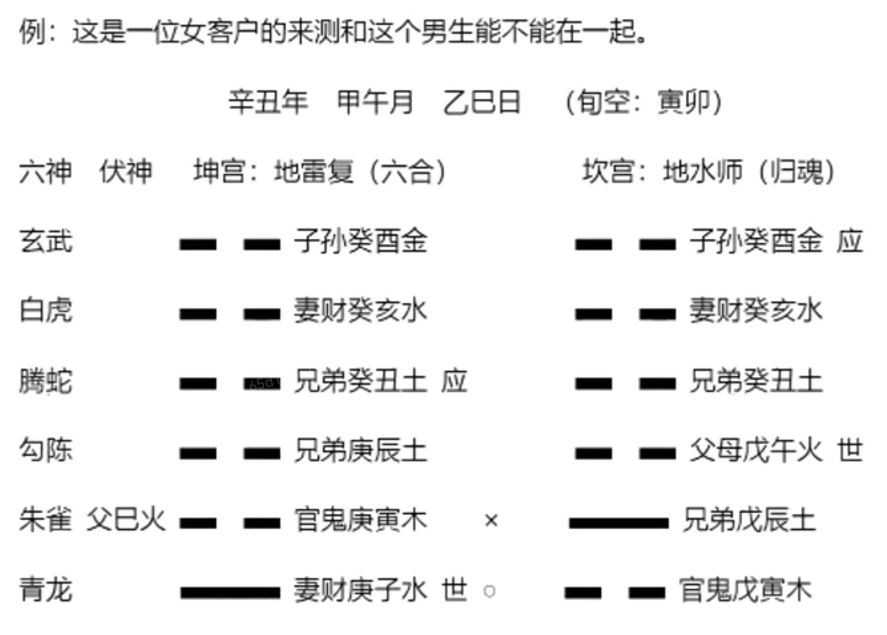

1. 女测姻缘，取二爻官鬼爻为用神，指这个男孩子。
2. 世爻为求测人。
3. 五爻妻财爻为竞争者。
4. 世爻发动，化出了官鬼寅木。
5. 世爻生二爻寅木，意义为这个女的很喜欢这个男的（二爻官鬼），另一点为第4点，证明非常喜欢这个男孩。
6. 能不能成？看用神（二爻官鬼）。用神发动了，合了竞争者（第3点）。此信息可以分析两点：
   1. 男孩子喜欢这个竞争者；
   2. 这个男孩子外边有人了（已经和竞争者在一起了）；
7. 再看用神空亡，空亡表示：1有可能二人分居；2表示男孩对这个女的不诚心。根据条件没有分隔两地，且求测能不能在一起也代表没有在一起呢，所以为男孩对她不诚心，或者说是没看上这个女的。所以判断第6点取2男孩子已经有人了。
8. 再看特殊爻。世爻子水月破，被冲了表示求测的事情空亡，而且月破还代表以前发生过事情，展开可能就为这个女的曾经有过恋情，结合求测的事情可以得出之前的恋情分手了；五爻亥水日冲为暗动，且合（这个爻也生用神，但是要先看冲合，再看生克）用神，合代表和合，暗动代表暗中，则表示这个竞争者跟这个男的已经在一起了，还是暗中在一起了。还能看出：
   1. 根据爻位，竞争者在五爻，表示道路，二爻为家里，表示这个女的已经去过男孩的家里了，联想为已经见过家长了。
   2. 用神是朱雀，表示男的口才也好，会说话，延伸为嘴甜。也就可能表示了为什么女的这么喜欢他，因为会哄人
   3. 用神还能根据纳音取象，庚寅辛卯松柏木，表示这个男的挺高大的。

### 测疾病

测疾病，以用神为主，用神得生病好，受克则凶，次看原神，原神是一个人的元气，是精气神，是生命之源。如果用神受克，原神又受冲或化坏，则用神原神都无用。

官鬼爻持世，病因是有旧愿没有还。

用神不受克但有病，临螣蛇或者是玄武则是虚病。

卦中无财爻或者财爻被克无用时，则病人饮食不进。

用神入墓或空亡，医治效果不好。

测老人病或者突发事故时：游魂卦，精神迷糊。神志不清。归魂卦：精神状态好，思维清楚。

归魂卦、游魂卦，测病可能有阴性信息。

白虎临申酉金时，也叫白虎含刀。测病必须动手术，有血光之灾的意思。

月破的爻被称为白虎煞，再临白虎叫双白虎，这个爻一定有问题。

初爻为脚，二爻为腿，三爻为腰，四爻为胸，五爻为脖子，六爻为头。

子水：足，血液，肾，耳朵。

丑土：脾，肌肉，消化系统。

寅木：四肢，肝胆，头，神经系统。

卯木：四肢，肝胆，手指，神经，腿，头发。

辰土，脾胃，肌肉，膀胱。

巳火：面部，牙齿，咽喉，心血系统，眼目。

午火：心脏，血液循环，眼睛，精神。

未土：脾，肌肉，脊梁。

申金：大肠，肺，骨骼。

酉金：肺，小肠，精血，牙齿。

戌土：胃，命门

亥水：头，肾，泌尿系统，生殖系统。

#### 一、自测病

世爻为用神，如果占得官鬼持世，皆主病情缠身，病根难除，此时子孙发动克世是医治得好。但日后会宿病复发，终是难以去除病根。

世爻旬空者，为自己不想求医或者没有找到有效的医疗手段。

#### 二. 测父母长辈病

父母爻为用神，官鬼爻是生父母爻的是原神，官鬼爻来生为吉，官鬼爻原神受冲、受克等则是生命之源受伤，病难愈。

#### 三、测丈夫或男友疾病

官鬼爻为用神，妻财爻为原神，有动爻生吉，来克则凶。

#### 四、测妻子老婆女友

财爻为用神，子孙为原神，兄弟爻为忌神，忌神动来克凶。

#### 五、测兄弟朋友病

兄弟爻为用神、父母为原神，官鬼爻为忌神，这时官鬼爻为疾病，忌神受子孙爻克制则吉。

#### 六、测小辈的病

子孙爻为用神，兄弟爻为原神，父母为忌神，如果发动来克用神则凶，如果有兄弟爻发动来生则吉。

### 测财运

求测财运，以财爻为用神，子孙爻为财的原神。

测生意，以官鬼爻为顾客，财爻为收入，两者都不能受伤。

技术求财：官爻为顾客，子孙爻为技术，但子孙爻不能多，如发动克官，顾客少。

#### 一、短期求财

1. 世爻旺相；
2. 财爻旺相：
3. 世爻与财爻有联系（生、合、比（这是梅花易数中的含义，其实就是六爻中的扶，即同五行））。

#### 二、长期求财

1. 世爻旺相；
2. 财爻旺相；
3. 世爻与财爻有关系（生，合，比）；
4. 子孙爻一定要上卦（意思为在卦中），要旺。

#### 三、合伙短期求财

1、世爻旺；2、财爻旺；3、财爻与世爻有联系；4、子孙爻上卦，要旺；5、世应相生、相合、相比。

#### 四、合伙长期求财

1. 世爻旺；
2. 财爻旺；
3. 财爻与世爻有关系；
4. 子孙爻上卦，要旺。
5. 应爻旺；
6. 世应关系好，生、合、比。

#### 五、讨债

1. 世爻旺；
2. 应爻与世爻关系好；
3. 应克世，对方不想还。
4. 财爻要旺。如休囚、为没有钱，若财旺、应克世，对方有钱，不想还。

### 测官司

1. 测官司：世爻为求测人或者我方，以官鬼爻为官方、法律或者法院。子孙爻为律师。
2. 财爻主理，父母爻主证据、诉状。通过世、应爻及卦中五行生克冲合来判断输赢。
3. 比如官鬼来生世爻克应爻，官司我方赢。如果官鬼生应爻、冲克世爻，官司我方输。
4. 财爻主道理，财爻生哪一方，哪一方占理。父母爻主证据、诉状，生助谁，谁就有证据。
5. 世、应爻谁发动，就是谁起诉。

### 测失物

1. 贵重之物、钱财、金银珠宝等以财爻为用神
2. 身份证、文件、衣物、书本等以父母爻为用神。
3. 宠物、玩具、古玩、字画等以子孙爻为用神
4. 用神休囚被克，失物难以找到，用神旺相被生被合可以找到
5. 用神在本宫内卦，其物未出家门，在家里找，在他宫外卦，在外面了，难以找到。
6. 官爻伏藏或官爻空、入墓、不动不是他人偷，世临螣蛇或游魂卦代表忘记
7. 玄武或官爻旺动是被盗。
8. 用神在五爻、丢失在路上、在四爻大门口寻找、在六爻是高处，在初爻地面找，初爻临水，在下水道附近、二爻临火、厨房里找。
9. 用神逢合、是有物品遮盖住，或盒子、柜子里找。

### 测工作、事业

预测官运、工作，升职、应聘等，官运升迁、工作升职、职称评定，找工作等一般都以官鬼为用神。

预测到指定的单位应聘是否成功，以父母爻为用神。但在实际预测中，不能拘泥死板，要根据卦象具体取用，

有利的情况是：官鬼爻持世旺相，或用神旺相被生、合世。

忌：子孙爻持世。或子孙爻发动克官鬼爻。

看职位：子午卯酉为正职，寅申巳亥为副职。辰戌丑未为杂职。

1. 官鬼爻临青龙：为公务员，高端体面。
2. 官鬼爻临白虎：为公，检、法、武职。
3. 官鬼爻临螣蛇：技术工作。
4. 官鬼爻临玄武：不公开、投机、股票等行业。
5. 官鬼爻临勾陈：坐办公室的。
6. 官鬼爻临朱雀：文化，互联网。

#### 卦例

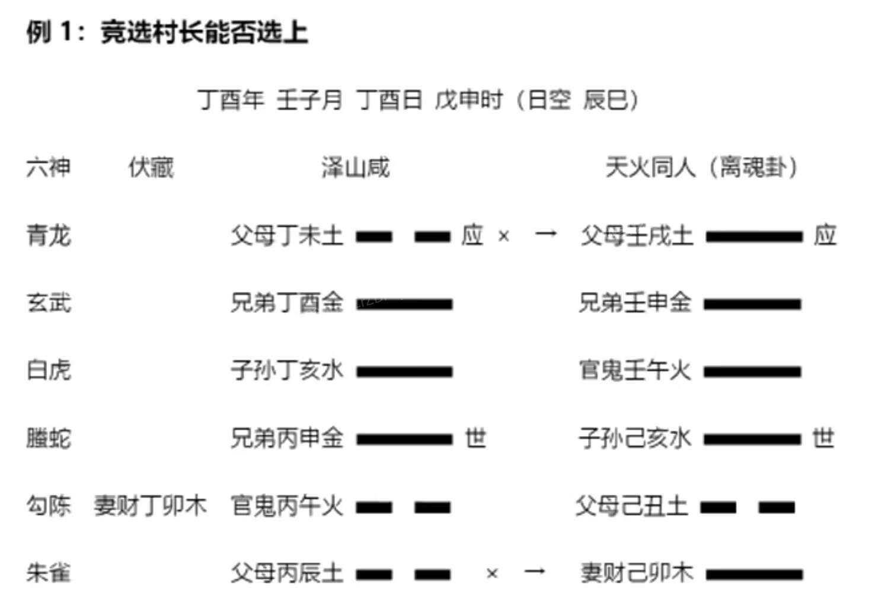

1. 世爻代表自己
2. 五爻兄弟为竞争者
3. 此卦就是代表，**不能死盯着用神**，有的卦就要要分析人事物进行定位，来看卦中是怎么揭示的。
4. 看异常：主卦初爻空亡；主卦二爻月破；变卦初爻卯木冲脱；
5. 初爻父母爻发动了，那代表父母爻代表的就是选票。有两个父母爻，则判断两个父母爻都分别是谁的选票，再看啷个选票谁多谁少。
   1. 初爻父母辰土合五爻兄弟酉金，所以初爻代表的选票是竞争对手的。初爻发动化出卯木回头克，并且卯木冲脱了，表示竞争对手的选票并不理想。虽然初爻和五爻合，但是初爻空亡，表示空合，白费，虚有其表。再看看其他补充象意：1.五爻临玄武，表示贪婪、私下里，联想为私下里给钱了来拉票。
   2. 六爻父母未土化出戌土，化进，表示选票一点点的再增加，未土又生三爻兄弟申金（五爻也是金，为什么不看？因为已经判断五爻和初爻搭配好了，就不用看了）。

### 测风水

#### 一、六神的应用六神代表方位

青龙主左边

白虎主右边

玄武为后边

朱雀为前面

螣蛇主中间

勾陈主中间

旺者为高、衰为低矮，空亡代表沟，低洼，勾陈主拐弯，青龙为直的，螣蛇为小路。

阳宅风水以气为主、卦中六合卦为藏风聚气，但如果有爻来冲则破气不好。

六冲卦不好、主散气、砂飞水走、不聚气。

#### 二、六亲的应用

父母代表房子、建筑物、高塔

兄弟爻代表阻碍物、门、墙，是破财、破气的因素，因为阻气散气

子孙爻代表聚气、财源、道路、过道，旺相发动是最好

妻财爻主气，为财气

官鬼爻代表官方的、黑社会场所，临玄武主出盗贼或遭盗贼

#### 三、爻位的应用

[爻位、爻象](#爻位、爻象)

### 断生死

不能用理法方式断，要按照以下的象断。

一般家人来问老人久病，或者老人走失几天，或者是发生了突发性事件，问生死的时候，这种情况就是断生死。地支丑就是牛头，午是马面，戌为阎王，艮为坟，坤为地府。勾陈为锁链，螣蛇为绳索。勾陈或玄武临兄弟爻=黑白无常。寅=黑无常，卯=白无常。六爻为黄泉路。断生死，忌神临勾陈或者螣蛇这种情况，可以直接断“死”。

### 夹的概念

夹一般用于取象，表示求测人或事被夹起，被控制的象意。夹共有以下三种情况：

例如：申金为用神，伏神午火和变爻未土是合的关系，夹着申金。这与现实社会是对应的。夹与公安抓坏人的时候是一样，一边一人把坏人夹在中间。阴差来抓人，也两个一起来。

震：水风井变震：泽风大过

​		   父母戊子水 ⚋

​		   妻财戊戌土 ⚊ 世

子孙庚午火 官鬼戊申金 ⚋ x

​		   官鬼辛酉金 ⚊

兄弟庚寅木 父母辛亥水 ⚊ 应

​		   妻财辛丑土 ⚋

---

兄弟丁卯木 ⚋

子孙丁巳火 ⚊

妻财丁未土 ⚊

官鬼辛酉金 ⚊

父母辛亥水 ⚊

妻财辛丑土 ⚋

---

例如：

申↘️

卯 卯木被两个同一个五行夹住

酉↗️

---

例如：（伏神寅木）动爻酉金→变爻寅木，动爻酉金被伏神和变爻夹在中间

### 往亡煞

代表死亡，特别是指在路上。代表鬼差的意思。一般用于测出行。

正寅，二巳，三猴申，四猪，五兔，六马来，七鸡，八鼠，九龙位，十羊，冬狗，腊寒牛

正寅 二巳 三甲 四亥 （驿马星）

五卯 六午 七酉 八子 （四中神）

九辰 十未 十一戌 十二丑（四墓库）

断人生死的时候，带往亡煞来克用神的时候就会死亡。

#### 卦例

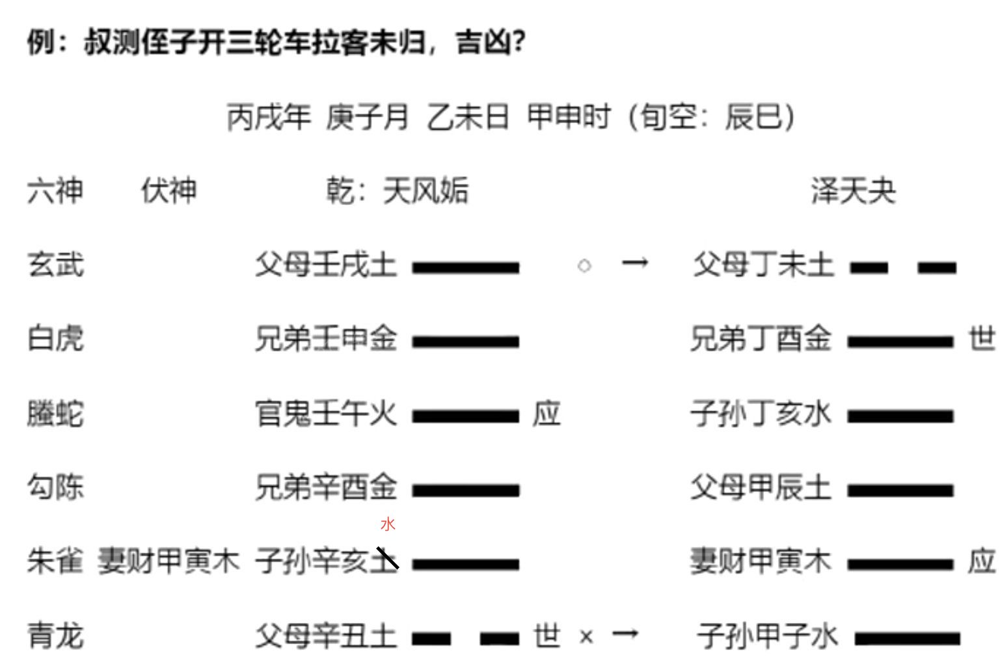

1. 二爻子孙爻为用神
2. 子月往亡煞为戌，正好六爻戌土忌神发动（往亡煞发动代表很凶），克二爻亥水，且化退，变爻未土克二爻亥水，初爻丑土忌神发动克二爻用神，判断凶，路上出问题了。
3. 二爻被伏神和变爻二爻夹起来，寅还是黑无常
4. 应爻代表所处环境，临腾蛇，腾蛇代表阴性信息，还是官鬼，说明阴间变鬼的象意，并且月子水冲应爻，月破，月破的爻为白虎煞。午火也是马面，丑土是牛头，都来找他，肯定没了，六爻还是代表黄泉路。
5. 看细节参看取象：日冲世爻，世爻冲脱，代表他在过桥的世爻发动，然后初爻六爻都是父母爻发动，代表两辆车相撞，掉下桥（初爻为地皮，临父母代表建筑，初爻与变爻合，说明连起来的建筑，临青龙代表大且直，延伸为桥）掉河（伏神、变卦二爻：甲寅乙卯大溪水；主卦六爻壬戌大海水；变卦六爻丁未天河水。所有都在说水，就算不说掉河里，也是在水里火周边爻水的位置）里了

### 断应期

比如测一个事情什么时候能成，什么时候不成。

动待合、静待冲、合待冲、冲待合。

衰待旺、空待出空、墓待出、伏待出。

伏吟待冲待合、反吟待合。

原神发动以原神定应期。

独爻发动时，应期往往在动变之间。

## 四大难卦

坎：坎为水卦、坎：水雷屯卦、兑：水山蹇卦、兑：泽水困

取象代表事情特别困难。主卦变卦都可以。

## 看胎儿性别

**看本卦子孙爻**

1.   看本卦中的子孙爻、五行属性为阳支（子、寅、辰、午、申戌）胎儿为男，为阴支（丑、亥、酉、未、巳、卯）胎儿为女。

2.   子孙交被日或月冲，阳支爻被冲怀的是女孩，阴支爻被冲怀的是男孩。

     > 这是看卦里的办法，还有一个办法是看外应，准确率更高。
     >
     > 求测人必须为亲生父母，看他哪边的身体动，左变动为男，右边为女孩。

## 一卦多断

### 一卦多断的常用技法

1. 如何断求测人家里或或家外有供神的情况，家中是神位，家外面是庙或者祠堂、教堂等，外卦是午申戌的组合（外卦是乾卦和震卦，都是这种情况）。戌→火库、庙、烧香的地力；申→五爻尊位，代表金、西方、西天极乐世界、菩萨等；午→香
2. 家旁边有河、桥。初爻临水、二爻临木、或者五爻临水、六爻临木，这种情况就可以断家旁边有河。
3. 家旁边有三岔路：五爻临申金
4. 家里门对门或门对窗：三、四爻临兄弟爻
5. 住宅地基有坟、或家旁边有坟：初爻临鬼库。
6. 因地基问题与邻居发生口舌争吵：初爻为邻居，初爻临朱雀父母爻。
7. 家中有人摔伤：六爻旬空
8. 判断离婚命：父母爻发动化出的变爻，冲配偶星。
9. 断有亲人淹死：雷地豫卦（六爻妻财庚戌旬空或者发动；五爻官鬼申金；四爻子孙庚午应；三爻兄弟乙卯纳音大溪水；二爻子孙乙巳；初爻妻财乙未世），六爻旬空或六爻发动，土空则陷，土动也往下边走，走到下边。
10. 家旁边有窑厂或锻造厂（有的时候是应了以前有窑厂，现在拆了）：六爻戌土临白虎，外卦是乾、震卦，六爻临白虎。
11. 判断有外遇：主卦有配偶星，动爻又化出配偶星。
12. 家里有人得癌症：六爻临白虎或者月破。
13. 判断新祖坟有洞：鬼库被月冲月破，或父母库临鬼月破。鬼库就是坟墓，父母的墓库临的六爻是官鬼。
14. 卦主（或亲属）的重病或者癌：世爻临白虎月破。
15. 家里有打死蛇的因果：初爻、二爻临巳火，被刑被冲。
16. 房子顶有破损：六爻月破。
17. 门、家旁边有学校：应爻临朱雀，子孙爻的库，或者临朱雀父母。
18. 判断腰痛：三爻月破或者发动回头克。
19. 判断女性乳房有肿瘤：五爻临官鬼，庚申（石榴木），外卦只能是震卦。
20. 断腹部动过手术：二爻临巳火（多验女性剖腹产）

# 解卦

1. 分析问题，找到核心或者说真正想要问的是什么
2. 取用神
3. 人事物定位（上一步取的用神，实际代表是人事物定位中的一种，比如代表应聘的公司、货物等）
4. 看卦中有问题的爻：月破、暗动、日冲等，旬空、入墓记录下来，待时而用。
5. 看吉凶：核心看动爻
   1. 一三、四六动，看看是不是三合局
   2. 先主卦再变卦，优先看对世应爻的关系（得先看有关系的人事物）即问题主线，最后看月日
6. 取象
7. 以上**要根据问题主线和联系实际去看作用以及象，**

静卦怎么看：

1. 静中找动；
2. 重看月、日对爻发生的作用（旺相休囚死）
3. 不断吉凶，只看象意

> “配对”指的是动爻或变爻(没有和本位动爻有关系的变爻)与其他爻单一作用配对，即生、克、冲、合可以作用多个爻（暂时不知道是最多四组配对，还是生克、冲合两组配对）；**存疑。能作用多个爻可能是因为下面所说的，在取象方面**
>
> 在理法断吉凶层面上，已经“配对”的是不能再作用别的了，但是在象法层面，还是可以看与其他爻的生克冲合关系，比如变爻与本位动爻有作用，但是象法上还可以看这个变爻对其他爻的作用，仅仅是取象，例：[男测婚姻](#男测婚姻)

> 先冲合后生克

> 动爻和变爻可以生克冲合伏神

> 理法中说的“无用、作废”，不是说这个爻就不能生克冲合了，含的作用还在，要看卦中告诉的信息，即本来生合挺好，但是被冲脱了对他没什么用了，“有心无力”；冲克是本来对他就不好，弄没用了就更不好了，“雪上加霜”。如官鬼化出寅木冲子孙申金，但是官鬼被日冲脱无用。不是说官鬼就不动，不去冲子孙了，而是表示官鬼爻所表示的这个老公不行了、老公没作用

> 墓库在理法上，动爻只能入本位变爻的墓，但是在象法上，可以联想墓库，如[女问这个胎是老公的还是情人的](#女问这个胎是老公的还是情人的)中的“变爻未土为官鬼的库”

> 伏藏或原神可以代表此人的内心想法

> 看到辰戌丑未就要想到库，在象法中，要看看卦中是否有符合库的五行，比如未土就是木库，爻找寅卯木，例：[找朋友拆借资金，朋友说晚上回话](#找朋友拆借资金，朋友说晚上回话)

> 主卦变卦表示：
>
> 1. 现在、未来
> 2. 因、果

> 合也可以代表慢，冲代表快。在某些问题中可以用这个象

> 四爻或三爻冲空、月破可以断：农村可能是大门掉漆或者坏了，得是木门；城市中可以断门口的对联有问题，比如歪了、掉了之类的，或者有响声。

# 卦例

### 女问这个胎是老公的还是情人的

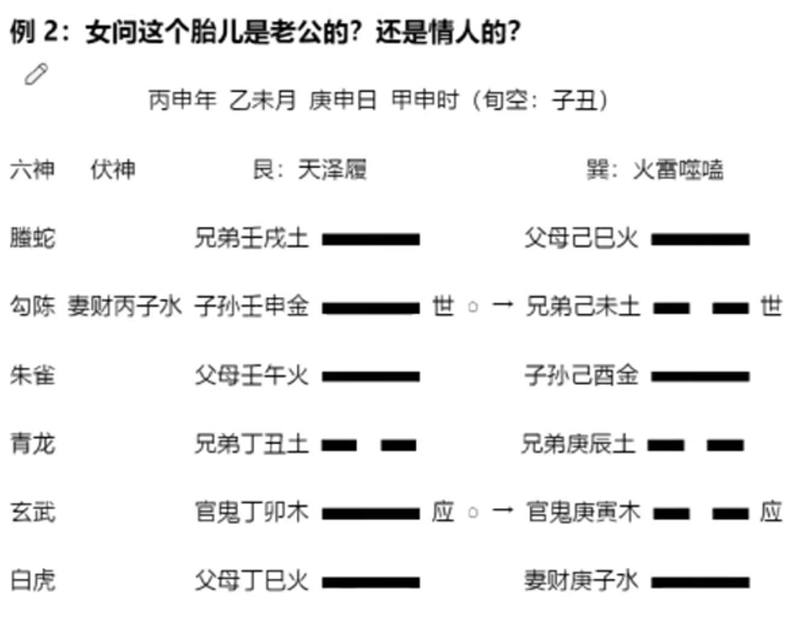

1. 取五爻子孙为用神。二爻官鬼为老公。情人暂时不知道是哪个，主要看子孙和谁有关系。
2. 子孙发动回头生，然后克了官鬼卯木；子孙申金合初爻巳火，合代表有关系，代表胎儿是初爻父母的，父母代表年龄大，白虎代表体型偏胖，脾气不太好，巳火代表欲望大
3. 官鬼化出寅木冲子孙申金，互相冲克，没有缘分；官鬼临玄武入月墓，入墓代表有能力发挥不出来，某些方面不太行；官鬼被日令冲脱，也代表官鬼爻废了；官鬼化退，也有退却离开的意思，对婚姻已经失去了信心。
4. 世爻在五爻临勾陈，子孙代表喜欢玩耍，享乐，取象在外面勾勾搭搭玩乐，变爻未土为官鬼的库，代表有很多男人喜欢追求她了；伏藏妻财，可以代表内心的想法，想通过这些男人弄点钱财跟着吃吃喝喝，但伏居空地，没有获得很多。

### 在这个老板那进货会不会被骗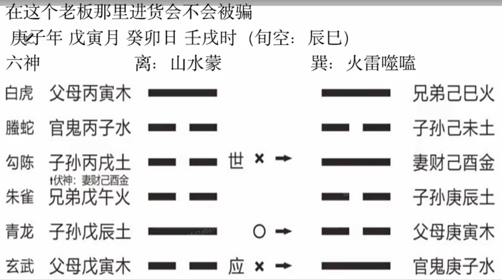

1. 分析问题找出人事物：求测人，货物，老板
2. 找人事物定位：老板跟求测人没有六亲关系，那么用应爻代表老板；世爻代表求测人（永远不变）；二爻子孙爻代表货物。
3. 找出所以有问题的爻
   1. 变卦四爻酉金冲脱（日冲）
   2. 主卦二爻辰土空亡
4. 看卦中爻之间的关系（生克冲合）
   1. 日冲四爻变爻，也表示这个人取老板那进货会不太好，更是二爻旬空，也表示不好
   2. 日克二爻货物，二爻还冲世爻
   3. 初爻（应爻）寅木发动化出子水，生本位动爻，把力量传递给寅木了，寅木力量增加。
   4. 初爻发动理论上可以：克制二爻辰土、可以生三爻午火、可以克世爻。实际上要找主线去看，要围绕问题去看，所以一定取克世爻。由此一个象就可以判断吉凶了，老板（应爻）冲克他就是骗他，生合他就是没骗他：老板克他所以是骗他。取象，应爻是老板，他化出官鬼，又临玄武，表示这个老板心里有鬼，克世爻，就是爻骗他
   5. 其他的爻怎么看？二爻子孙代表货物，发动化出了寅木，回头克，可以代表货物的质量不好
   6. 再看四爻子孙爻发动，化出的妻财酉金冲脱就无用了，**主卦代表当下，变卦代表未来**，就说明如果从这进货，就说明未来就破财了。

### 女客户测和这个男生能不能在一起

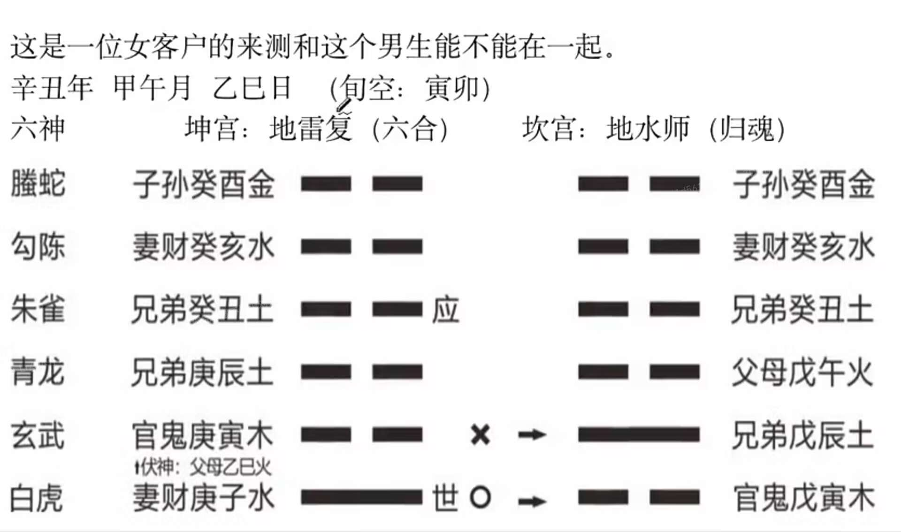

1. 世爻代表求测人；女测姻缘看官鬼爻，则二爻代表这个男孩子；五爻也是妻财，代表女性竞争者，女测姻缘妻财爻代表竞争者（男测姻缘官鬼爻就是竞争者）
2. 找出卦中有问题的卦：
   1. 五爻静爻日冲（巳亥冲），暗动
   2. 二爻寅木空亡
3. 核心看动爻：
   1. 初爻妻财子水发动，化出官鬼寅木，寅木没有对本位动爻进行作用，就可以和其他爻作用，理论上可以：合五爻亥水、克三、四爻兄弟丑土和辰土。根据这些条件，看不出吉凶，那看其他爻
   2. 二爻官鬼寅木发动，化出兄弟辰土，对本位动爻没有作用，理论上可以：生六爻兄弟酉金、克制五爻妻财亥水、克初爻世爻妻财子水。爻围绕主线看，所以辰土优先克制初爻世爻妻财子水，且本位动爻旬空，代表男生不诚心（在测感情时候，旬空可以用来判断吉凶），所以凶，代表男生不能跟她在一起。

### 对方会不会租自己的房子

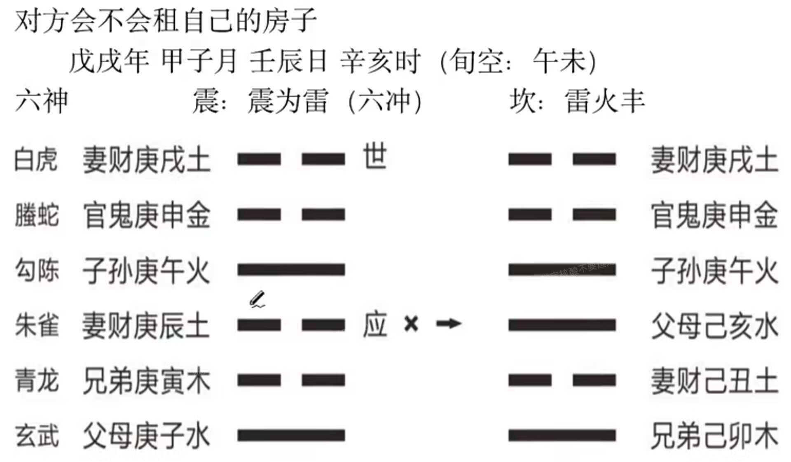

1. 人事物定位：世爻求测人，取初爻父母爻为用神代表房子，应爻代表对方，爻自己的房子肯定还有其他人的房子，取二爻兄弟爻为竞争者（其他房东）
2. 找出有问题的爻：六爻世爻是静爻日冲所以暗动、变卦三爻入日墓（水库）、主卦初爻入日墓（水库）
3. 核心看动爻。三爻应爻代表对方，辰土发动化出亥水入墓，此变爻无用了，本位动爻优先冲六爻世爻，代表对方拒接租自己的房子，且变爻不对本位动爻有作用，与二爻兄弟爻（代表其他人的房子）相合，凶，表示对方不会租自己的房子，会租其他人的房子。

### 面试是否成功

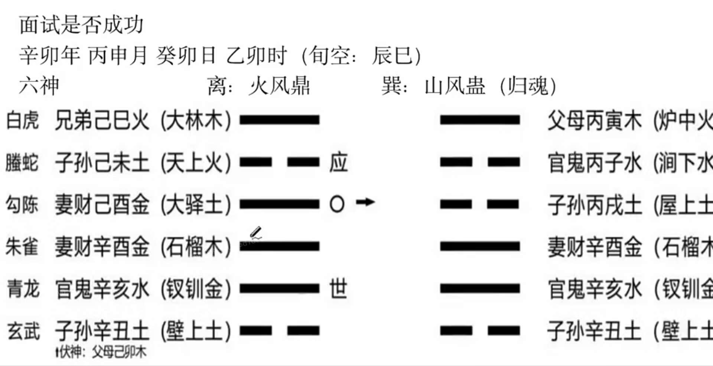

1. 问题不涉及多方，所以仅仅看用神即可，取二爻官鬼爻为用神。
2. 四爻酉金发动，化出戌土回头生，然后酉金又生了世爻亥水，，卯日把四爻酉金冲脱，则凶。

### 大姨妈没来，何时来？是否怀孕了？

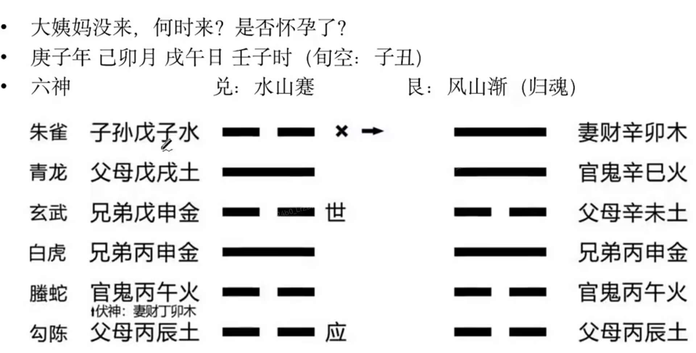

1. 不涉及多方，仅看用神。取六爻子孙爻为用神。
2. 六爻子水发动，化出卯木，没有作用，但是子水被日建所冲，冲脱，表示没怀。

### 女客户来问什么时候能要上二胎

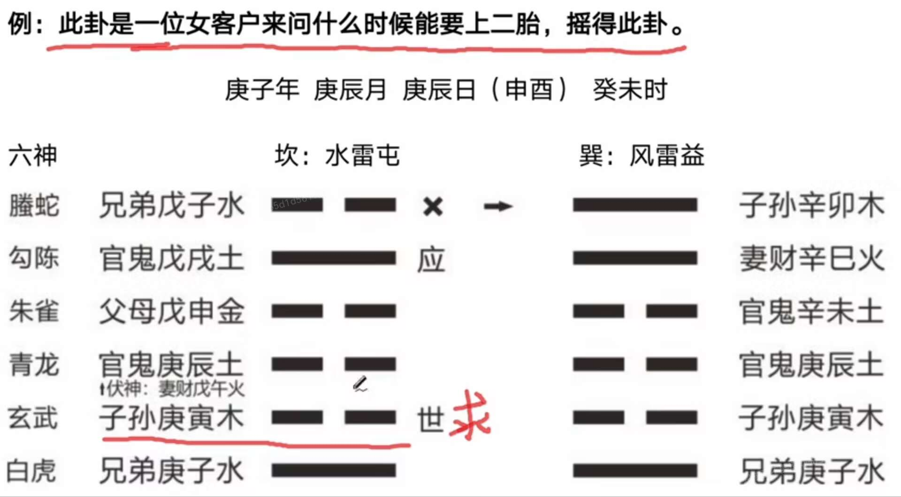

1. 世爻求测人；二爻原神子孙代表二胎；卦中有两个官鬼，都代表丈夫，看卦中哪个更像这个胎儿的父亲：三爻青龙+官鬼代表正宫表示这个女的的正式老公，但是卦中所示六爻子水发动化出子孙卯木，且卯木合应爻官鬼戌土，表示这个孩子是五爻官鬼的，所以取五爻。（如果五爻没有任何指示的时候，就取青龙+官鬼为丈夫）
2. 五爻入了月日墓，表示凶，所以要不上二胎。
3. 取象：五爻被月冲，月破，表示这个男的有疾病，所以未提不在女方，在南方，六爻子水入墓，子水象征液体的东西，且在男方，那么就象征精子（在女方则表示卵子），入墓表示发挥不出原有的作用、能量了，表示精子有问题，引申出精子成活率底

### 经常乱做梦，头经常疼（静卦）

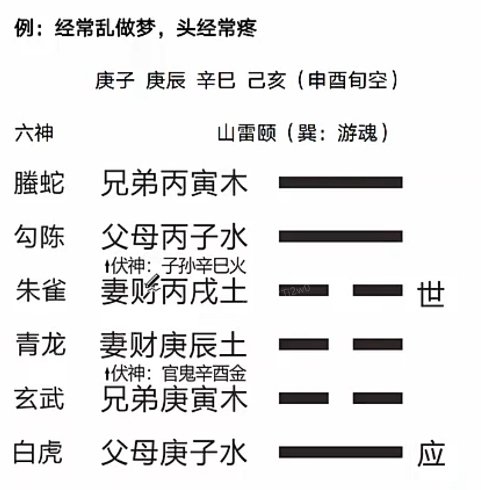

这个卦没有吉凶可言，只要找出乱做梦，头疼的原因就好（私以为，没有动爻，无法判断吉凶）。

1. 世爻代表求测人；
2. 找特殊的爻：世爻月破、巳日刑了六爻寅木
3. 核心看动爻：没有动爻，而且此卦不看吉凶
4. 取象：世爻月破，加上自述，可判断为生病了；乱做梦，六神为腾蛇，头疼按照爻位为六爻，可以表示为由虚惊怪异之事影响头部；巳日刑了六爻寅木，卦宫为巽，属性为木，木生火，我生者子孙，表示巳日临子孙爻，事业时可以指代更大的领导，但是这里表示在天上的子孙，恰好伏神也为子孙，且飞神是父母爻，由此可得其有已故的孩子，初爻和五爻都为父母爻，根据移神换象，可以互相参看，白虎主金属物凶器，职业中也表示医生，结合勾陈，可以表示动过手术，结合起来可表示为流产或堕胎，由飞神克伏神，表示父母不想要孩子，所以结果为堕胎。

### 创业居家养老项目是否顺利（静卦）

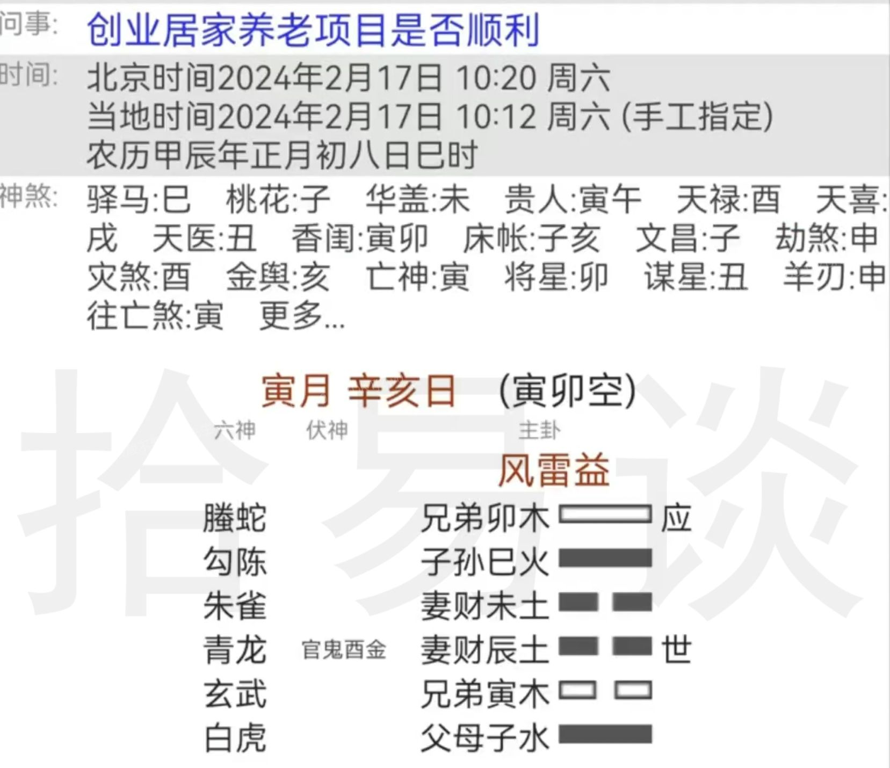

条件：会招一批技师，上门给老人进行护理

这是个静卦，需要1.静中找动；2.重看月、日对爻发生的作用

1. 定位，隐含求的是能不能挣钱，所以看妻财爻，取世爻上的妻财爻
2. 找要问题的爻：五爻巳火被日冲，暗动；三爻寅木旬空；

老师断语：今年不行，明年再做：卦中有两个妻财爻，月日上不旺，所以表示不是时候，这个卦是甲辰龙年的卦，刚好持青龙，且没有动，表示今年不太行；但是五爻巳火暗动生世爻啊，对世爻好为啥不能做？但是这个事情是要长久的，但是财不旺，做了也可以但很难挣钱，巳和辰就隔了一年，更表示明年做正好就可以挣钱了。对于哪个代表客户而言，应该取初爻父母爻代表客户，官鬼代表的是广义的事业、客户，但是这个人的业务是挣老年人的钱，所以应该取父母爻，且临白虎代表这些老人也是爻病在身的。五爻取象：对于老人（父母爻）而言，子孙应该代表的是技师（子孙有技术的象），暗动表示技师也需要时间准备、学习，还可以取子孙爻所在五爻代表领导，暗动也表示有领导在支持、帮助

### 年底能不能评上先进（静卦）

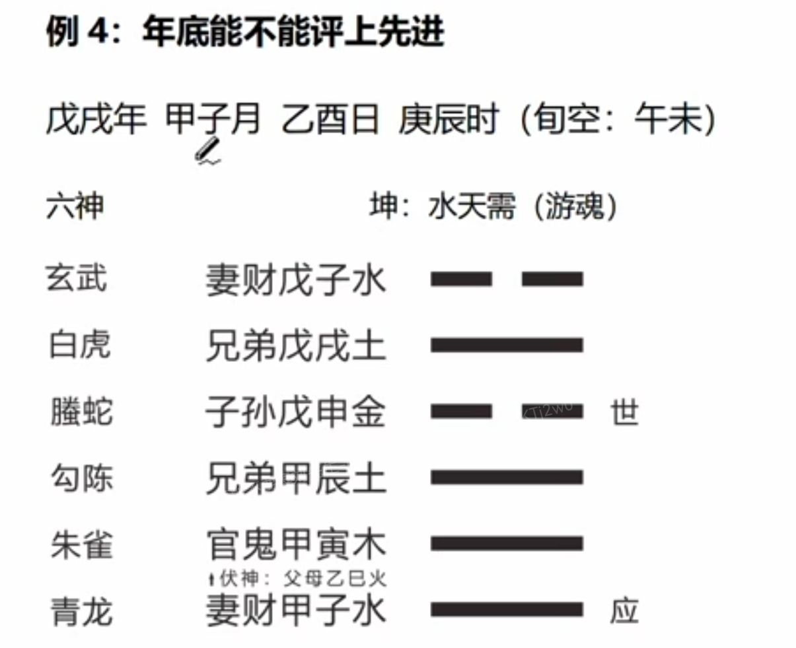

1. 世爻代表求测人；伏神为用神，伏神能出伏就能得到，出不来就不能得到；
2. 飞神生伏神，伏神出伏，合四爻申金，所以能评上先进；
3. 象：二爻官鬼爻代表官方，伏神表示还没有公布

### 猫跑出去了，还能找回来吗

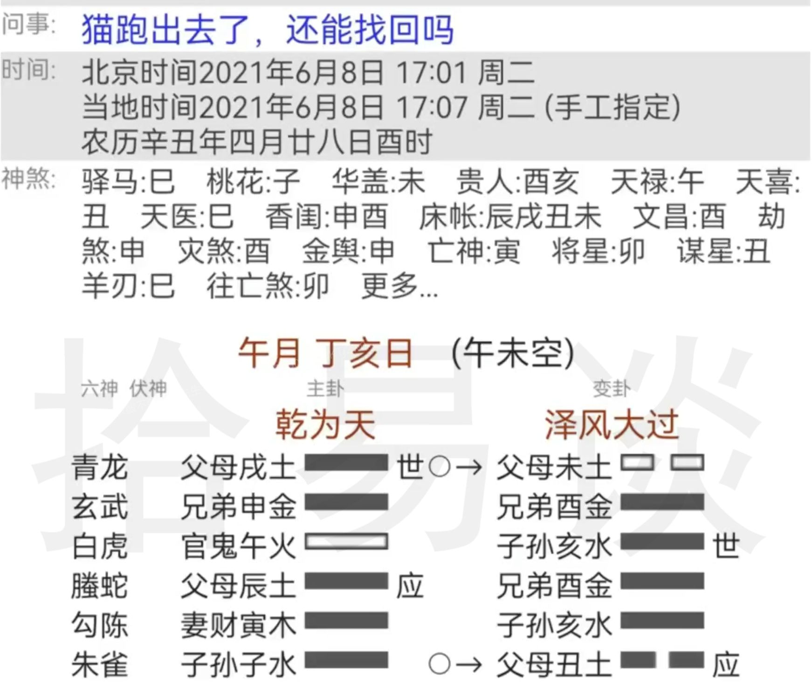

1. 世爻为求测人；初爻子孙为用神代表猫；
2. 世爻发动化出未土，表明主人出去找猫了，虽然卦中世爻克子孙，但是不代表找不回，主人肯定不会害宠物的，所以这个克不能看做是伤害猫，这个克表明的其实是主人取找猫，所以这看不出来猫能不能回来，所以不要盲目看冲克，要看卦告诉你了什么。如果不是世爻克，而是其他爻发动克它，那就是要以凶断；走失的情况下，爻多看月日上有没有气，如果克用神，就不行，日生、日扶就代表没有危险。卦中用神发动化出丑土回头合，表示这个猫没有危险，且临朱雀代表说、语言等意，又是子孙，快乐之象，而化出的变爻合本位动爻，合在感情中表示婚姻之道，引申出这个猫出去谈情说爱去了。
3. 判断哪个方位去找：用神临子水，为北方，所在的卦象又是乾卦，可以定西北
4. 哪天能谈完回来：根据实际情况，猫跑丢了，也就几天会回来，几月几年毕竟不可能，根据断应期，动待合，子丑和，所以可能是丑日回来。

### 能否中标

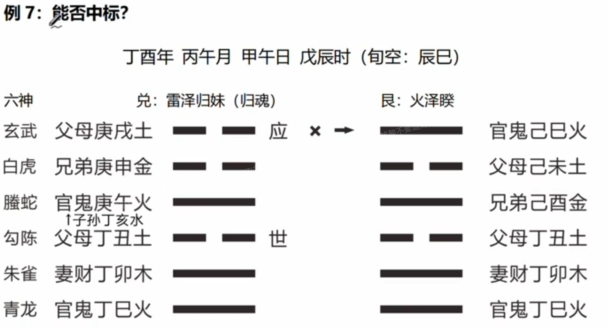

1. 世爻代表自己；五爻代表竞争对手；六爻应爻代表发标单位
2. 有问题的爻：没有。
3. 核心看动爻：
   1. 六爻发动，化出巳火，回头生，应爻又生五爻金，跟世爻没关系，所以求测人不能中标；
   2. 为什么没中？六爻变爻临官鬼表示领导，领导回头生了戌土，戌土又生了五爻申金，且六爻临玄武，表示有暗中操作

### 男测婚姻

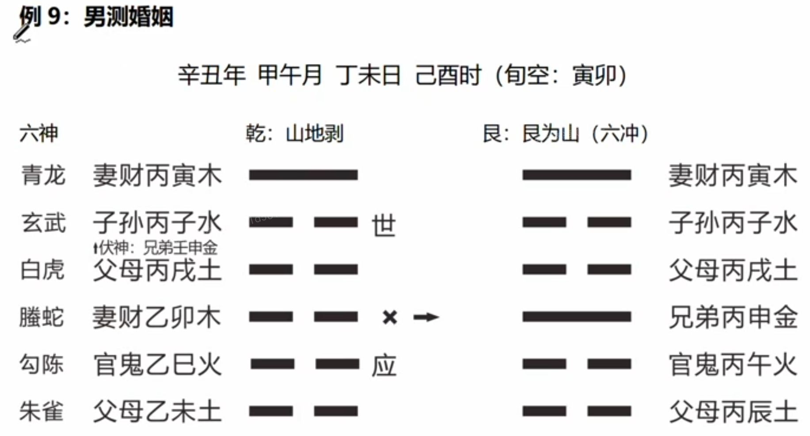

1. 世爻代表求测人；取三爻妻财为用神（有动取动）
2. 有问题的爻：
   1. 世爻月破
   2. 用神入日墓、空亡
3. 用神发动化出回头克，凶，婚姻没戏了，因为老婆不想跟她过（回头克）；为什么没戏：二爻官鬼爻为竞争对手，与二爻变爻是合的关系，本位动爻又是生二爻（为什么变爻与本位动爻配对了，还能看变爻跟二爻、本位动爻和二爻的关系？在理法的吉凶层面上，配对的是不能去作用别的了，但是取象上可以看），由此看出是他老婆有外遇了，二爻又临勾陈代表勾搭，还能看出是他老婆主动的，因为是三爻发动的，表示主动。
4. 世爻月破，表示求测人有疾病（月破有得病的象），临玄武代表隐私的、不能说的、难以启齿的，子水也表示肾脏、泌尿系统；纳音丙子是涧下水（涧水很快），所以便是男的有病。

### 找朋友拆借资金，朋友说晚上回话

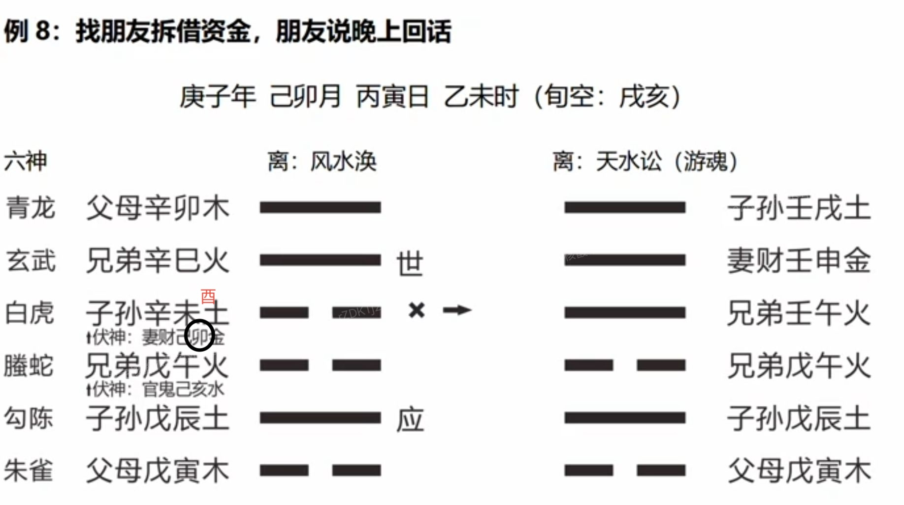

妻财是酉金

> 我的回答：
>
> 1. 世爻代表求测人；五爻是用神，表示朋友（优先取世应爻位置为用神）
> 2. 有问题的爻：
>    1. 四爻伏神月破
>    2. 三爻伏神旬空
> 3. 四爻未土发动，化出午火，回头合、生，伏妻财表示有钱，但是妻财旬空和月破，四爻变爻午火与世爻相合，综上表示这个朋友跟他关系挺好，也愿意借钱给求测人，但是之前有钱，可是现在没了
> 4. 四爻伏神出伏发动，生三爻伏神亥水；三爻伏神亥水出伏发动，与五爻相冲；五爻世用合一，即表示卦主的朋友（用神），也表示卦主自己（世爻），再根据伏神、动爻、变爻一损俱损的知识，所以是求测人的朋友把钱用在了其他地方，所以没有钱借给求测人
> 5. 三爻临腾蛇和兄弟爻，再加上五爻和三爻六亲和五行相同，互相参看，再加上伏神官鬼亥水克三爻午火，可能表示是求测人的朋友被骗财了
>
> 反省：取用神就取错了，用神应该是借钱，钱财的事是妻财爻为用神

1. 世爻求测者；四爻伏神酉金为用神；应爻不是朋友，应爻表示的是问题中，与卦主毫不相干的，比如去一个老板那进货，或者租某个人的房子，这个人与卦主不是朋友不是亲人的，这才用应爻代表。朋友取三爻兄弟爻代表朋友。
2. 伏神妻财月破；三爻伏神空亡
3. 四爻未土发动，化出午火回头生合，这一点与求测者毫无关系，所以看不出来结果；四爻未土生伏神妻财酉金，伏神可以出伏，但是被月建冲，此时就不是月破了，或者说取的是被冲的关系，根据一损俱损，三者中被冲了，表示都不好了，所以朋友不会借钱。
4. 为什么不借钱：三爻兄弟伏藏官鬼，而且伏神克飞神，可以表示朋友心里有鬼，不想借钱，临腾蛇代表谎言，表示了朋友会找个借口，六亲相同的爻可以互相参看，所以可以看变爻的象，变爻回头合子孙，看到辰戌丑未就要想到库，未土是墓库，在卦中显示的是父母爻的库，并且临白虎，所以借口可能是小孩生病花钱了，或者是父母生病花钱了，但是结合实际情况，正常的孩子生病基本也不会花很多钱，父母年老，老年人容易一身病，所以两相比较还是父母准点，所以是说谎给父母的病花钱了。

### 看中一个店面，能否租下来

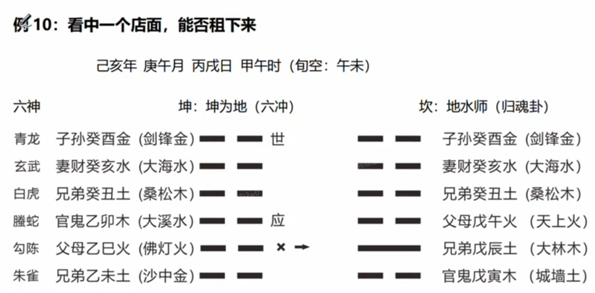

1. 二爻父母爻用神；房东与求测人无关，所以应爻是房东；兄弟爻代表竞争者；
2. 二爻巳火入日墓；初爻空亡；日冲变爻
3. 二爻巳火发动，化出辰土，对本位动爻没有作用，则看他们分别作用：动爻巳火克世爻酉金，变爻辰土合、生世爻，但是变爻被日冲脱，所以一定租不到店面。
4. 为什么租不到：世爻临青龙，表示求测人想租一个比较新的店面，用神临勾陈，表示老旧的店面，所以可能求测人在犹豫中，卦中兄弟爻都是土，日也是土，所以日可以代表兄弟，变爻是店面，被冲脱，说明店被竞争者抢了，也就是抢先租下来了，还有就是在象中，用神生初爻兄弟，也可以表示店面是竞争者的了。

### 卦主母亲脑梗，问什么时候能好，现在嘴歪说话不清楚

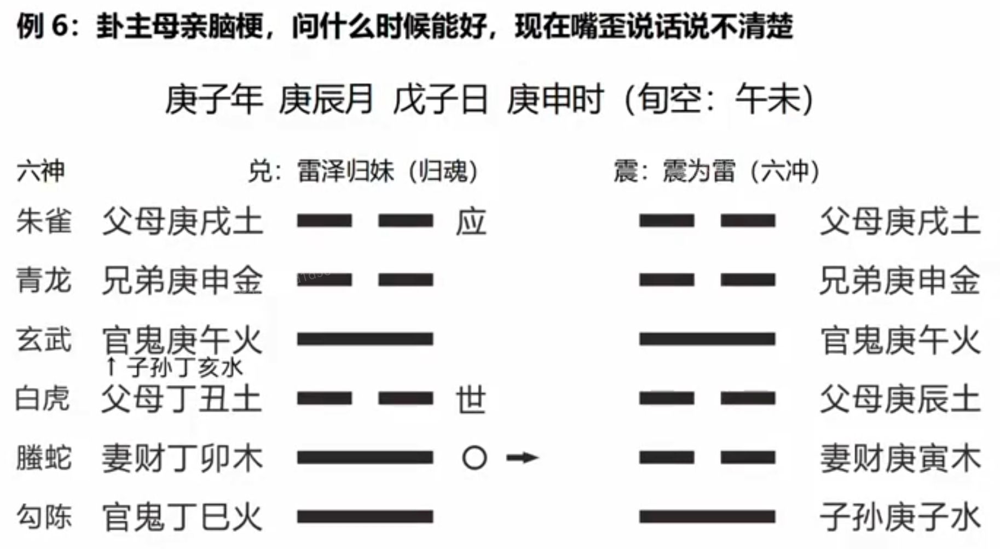

要先分析问题：表面是断应期，但是脑梗，且有了后遗症（嘴歪说话不清楚），这种后遗症一般都很严重，只能减轻症状，很难彻底治愈，其实不是看吉凶，而是想解决问题

1. 优先取父母为用神
2. 六爻月破；四爻被日冲、旬空，为冲空
3. 其实用神取哪个都行，因为可以互相参看，但是六爻月破，月破也代表病，且六爻是父母，六爻位置也表示头部，所以卦清晰的指明了六爻是卦主的母亲，即六爻为用神。
4. 二爻发动，化出寅木，无作用，分别配对。本位动爻卯木合、克六爻戌土，变爻寅木克六爻。虽然先看冲合后看生克，但是主要爻看卦告诉我们什么，实际上二爻是忌神，所以取克，动变都克用神，忌神还化退，动变表示现在和将来，表示这个病一时半会好不了，但是化退表示能量在减弱，所以说会一点点变好。反过来看合的关系，合也代表慢，也表示这个病已经不是一天两天了，要缠着很久。
5. 应用一卦多断：主卦外卦为午申戌的组合，表明家附近有庙、教堂，或者家中有香火（反馈家附近有个黑龙庙），午火代表香火，被日建的子水冲空，证明香火不旺；还可以取官鬼爻代表神灵，神灵被冲空代表这个神灵没有起到保护地域的作用
6. 怎么办：忌神发动，忌神所在二爻表示家中，动爻变爻都是木，表示家中有很多花花草草。要把花草移位或者扔掉，
   1. 这样在风水上，就表示花草动了，就可以化退了；二爻也代表宅、床、柜子，可以把床或者柜子移动位置，让忌神力量减弱；四爻为大门，官鬼空亡，表示门上没有门神；在一个冲空也可以说他们家的大门掉漆了或者坏了，联系实际这种一般是农村的大门有可能是木门。四爻是原神，因为旬空了，被日冲才是冲空，怎么解决呢？不能说吧黑龙庙的香火弄旺了，这太难，只能通过改变家里的风水，省钱点，吧大门重新刷漆，什么颜色呢？午火表示红色。这样一旦午火被填实，日建以冲，这时候可以变成暗动了，暗动起来了，卯木就不直接克制用神了，而是卯木生午火，午火再生戌土就起到了通关的作用；另外一个维度，卦中官鬼代表神灵，看风俗兴不兴贴门神，兴就直接贴个门神，这样午火和官鬼都被填实了，也是通关的作用，这样会更加舒服一点，回复的也就更快一点
   2. 另一种在个人身上来化解，这就要用到通关化解。忌神爻用通关化去他，不用补，即克（以此卦为例，补可以用二爻表示腿，那在腿上戴金链子，这样金克木）。二爻为腿，寅卯木代表四肢，可以穿红裤衩、脚上戴红绳，这就可以有午火（卯木就不直接克制用神了，而是卯木生午火，午火再生戌土就起到了通关的作用）

### 宫颈用药出血是因为癌变吗

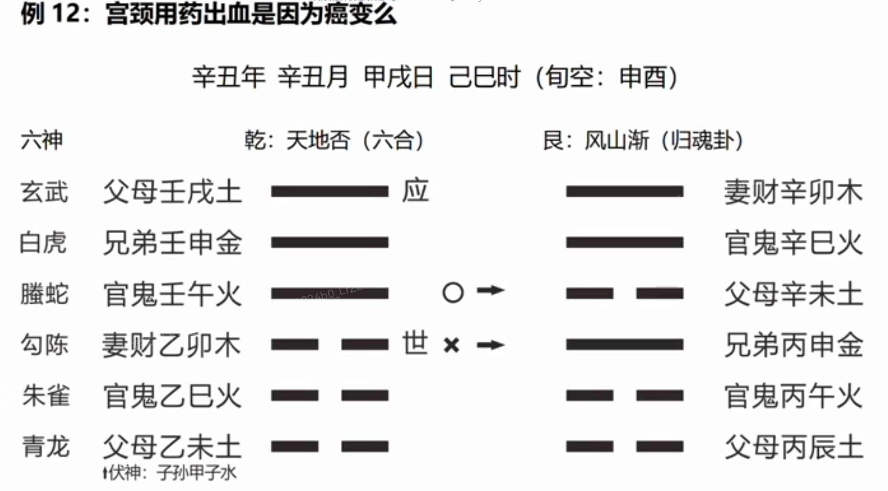

这是自测卦

卯木发动，化出申金回头克，凶，首先病情就是凶，接下来看是不是因为癌变。

妻财卯木临三爻，二爻三爻都能代表腹部，对应上了问题中的宫颈位置，临勾陈代表有肿块。

出血的象怎么取？风水上说，山管人丁水管财，反推财也有水的象意，这就宫颈出血的象意就出来了。

主卦代表当下，变卦代表未来，未来化出申金回头克，并且变卦申金临的兄弟爻，主卦也有，临白虎，白虎代表疾病、重病、血光。代表未来会有癌变的可能。白虎临金，表示白虎含刃，在测病时，就代表一定会手术，也代表手术刀的象意

### 一老年女人求测，这两天晚上梦到死去的亲戚，感觉头昏

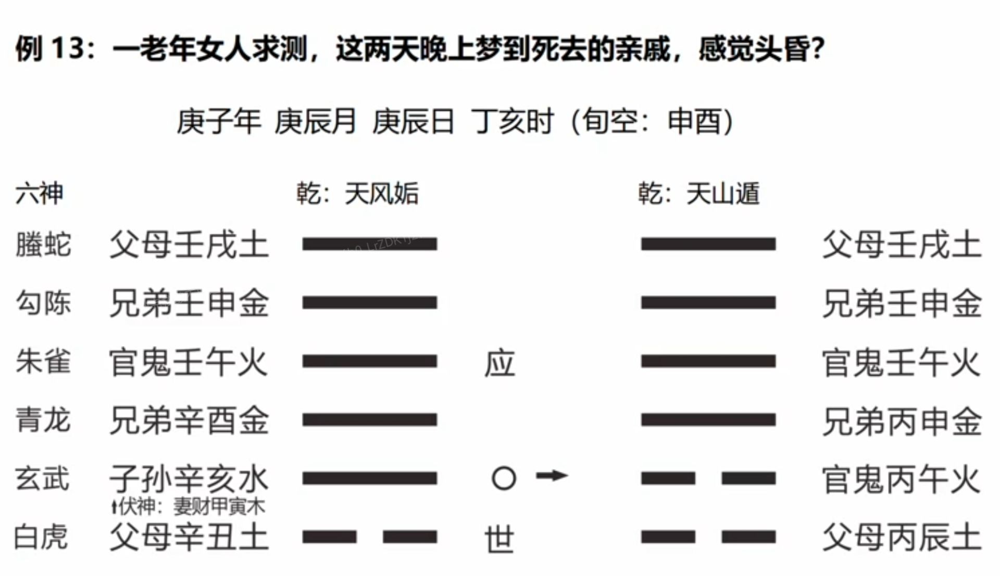

分析问题：做梦是腾蛇，死去的亲戚，头昏：六爻为头

1. 六爻月破；二爻入日墓
2. 子孙亥水发动，化出官鬼生世爻，看起来没什么问题，而且这个卦看不出吉凶，也没有吉凶可言，实际问的是什么原因，只要把原因找出来就行，直接就看象。首先依照问题去找。
3. 六爻为头，月破表疾病，为什么不舒服？戌土父母爻可以代表房子，又是本卦中官鬼的库，初爻和六爻有祖坟、太庙的象意。祖坟月破就是祖坟有洞。被子水冲一般是老鼠洞，辰（蛇也称小龙）和巳代表蛇洞，被辰所冲，判断出祖坟有蛇洞。
4. 官鬼爻代表广义的疾病，四爻是胸口的位置，所以对方胸口也不舒服。
5. 动爻发动的变爻又是官鬼午火，主卦中官鬼午火是不舒服，那在变爻这里也一样不舒服。二爻代表腹部，那么 腹部也不舒服
6. 卦中妻财爻伏藏，伏藏可以代表不显的、已故的，飞神生伏神，出伏克制世爻，也是对求测人的一个不利因素，可以说是已故的女性长辈（妻财+父母），妻财也代表吃喝，说明这个已故长辈没有吃喝了，此时涉及到化解，用通关化解。首先寅木代表四肢本身又在二爻代表腿，在腿上的木克制土，那就要用火来化解，木生火，火再生土，可以腿上绑红绳；其次烧纸，怎么烧？妻财爻临寅木，艮卦藏的是丑和寅，是东北方，就去家的东北方向，子代表1，丑代表2，寅代表3，可以东北方向走30步，或者在东北方向找十字路取烧纸。烧几张？根据河图数，木取3，8，还可以38，但是烧纸有讲究，少了不乐意，多了不愿意走，所以取中间，8张纸。

### 测一长辈病重

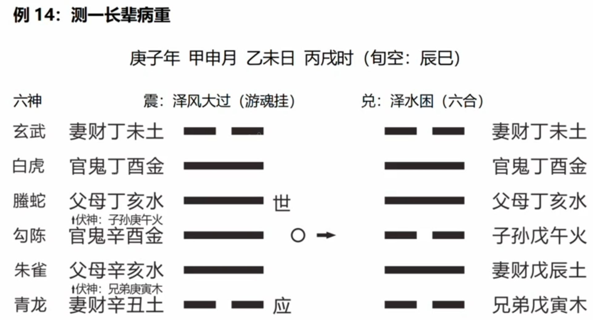

1. 用神四爻父母爻
2. 二爻伏神月破；初爻暗动
3. 官鬼酉金发动，这时候官鬼就不能代表病了，因为他是世爻父母爻的原神，是生用神的，所以在理法上就不能当疾病看了。化出午火回头克，说明这个长辈病的还很严重，原神发动化出回头克，问题又是病重，忌神（初爻）暗动来克制世爻，所以说明人快不行了。暗动代表暗中的，暗动是被冲起来的，冲有快的象意。在测人时候，尤其是老人生病的时候，游魂卦代表昏迷不醒。官鬼爻两现，官鬼代表广义的疾病，虽然理法上卦里官鬼不代表疾病，但是象法就是疾病，理是理，象是象，象上就代表疾病，象发非常灵活，只要是结合实际情况下的东西，都可以合理的取。两现就代表多。啷个官鬼就表示多个疾病，临白虎又临勾陈，勾陈代表肿块、癌症，那么到底是什么？两个官鬼爻都是酉金，酉金代表肺部，又在三爻五爻，反馈是肺气肿。到底哪一天会走？初爻暗动，说明应期快，很快就会去世，就爻在日上断，当天乙未日，原神受生，那么当天可能就走了，往后数，申、酉日生原神，戌日变爻入墓也不会走，亥日世爻当令不会走，子日扶世爻冲变爻不会走，丑日忌神（初爻）当令克世爻就代表会走。应期中动待合，为什么不找合呢，因为是快啊

### 问今年财运

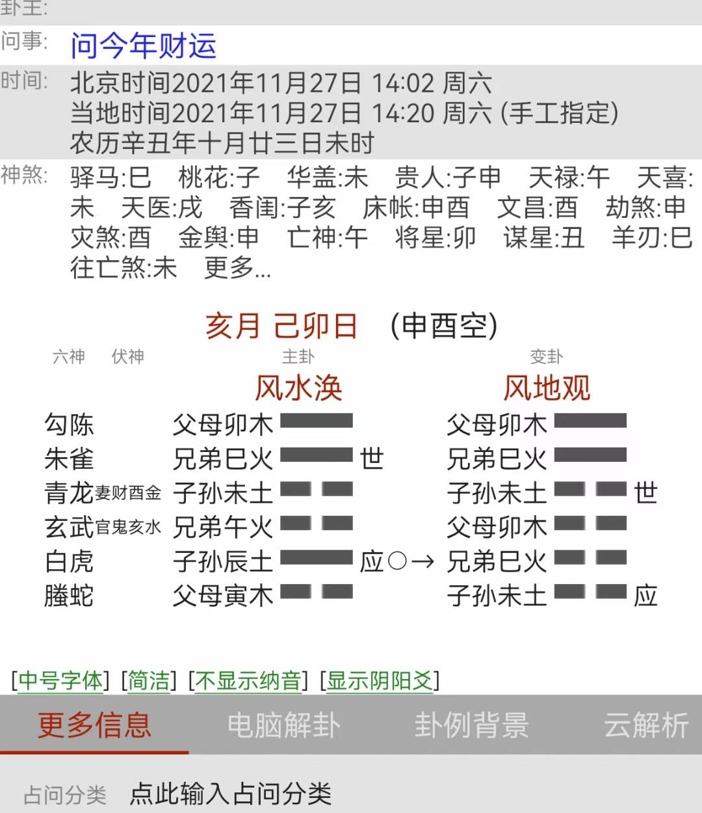

### 父亲测儿子，有人给介绍了女朋友，问能不能成

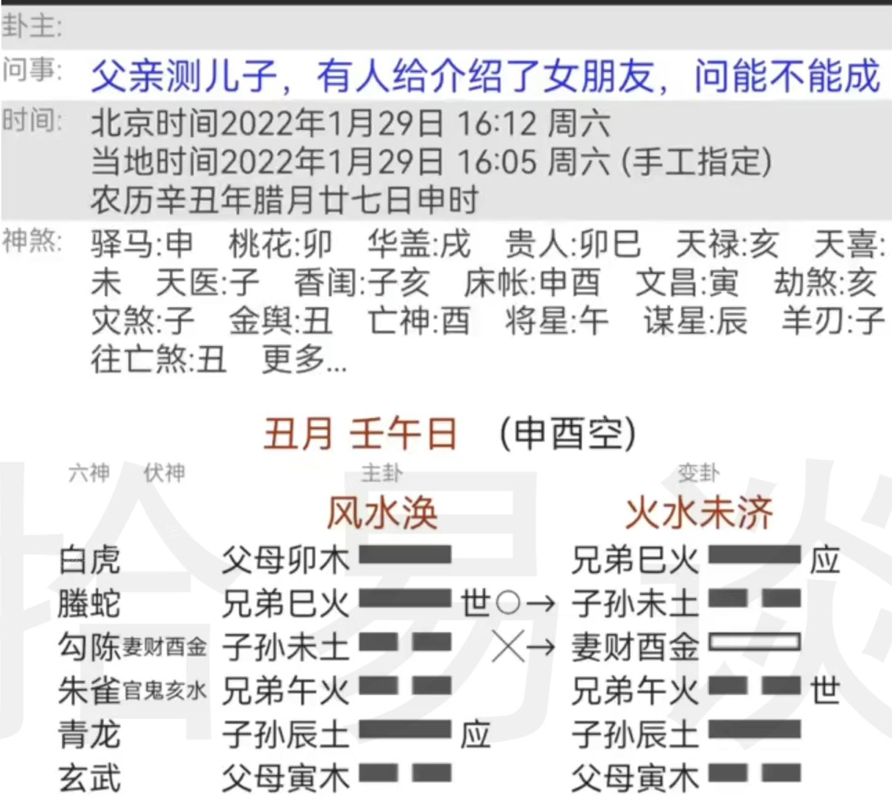

1. 父亲测儿子，则子孙爻代表儿子，青龙主血缘，所以优先取二爻代表他的儿子，综合判断最接近的；女朋友看妻财爻
2. 妻财爻空下伏神，表示事与愿违，凶；未土发动化酉金，合二爻辰土，合代表夫妻之道，但是变爻旬空，空合，表示成不了

### 问老婆有没有外遇（静）

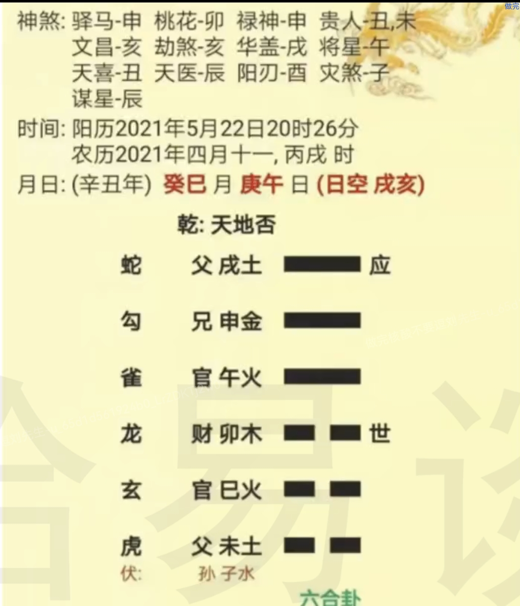

1. 静中没有动，妻财爻在日月上也不旺，则需要与问题联系上
2. 官鬼爻代表竞争者两现，表示二婚或者外遇，但是在多现的爻没有与这个妻财爻发生关系的时候，只能代表多
3. 象上应爻与三爻用神卯戌合，但是戌亥空亡。静卦可以这么看，动爻就不能。
4. 问外遇这个事情，肯定是求测人得到了什么消息，恰好应爻与用神相合，父母爻也代表消息，就说明求测人受到了妻子在外面合的消息，应爻临腾蛇，腾蛇代表虚假，又是空合，则表示他听到的消息是瞎说
5. 用神卯木，在桃花位，表示妻子漂亮，临青龙，表示正直，说明这个女的漂亮又正直，所以也说明妻子不会外遇

### 问老公有没有外遇（静）

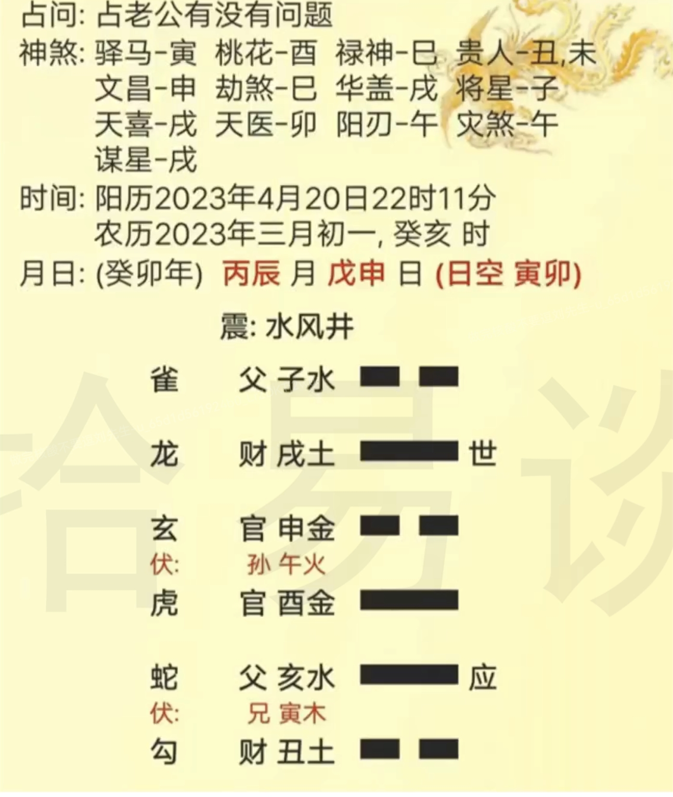

> 根据问题分析思路：女的听到风声、求测人近况、女方找到点蛛丝马迹

1. 官鬼两现，定位哪个是她老公，四爻伏藏子孙又临日，则四爻为她老公。他老公临玄武，表示偷偷摸摸，不能见光。子孙爻伏藏克制官鬼，在人身体方面代表性器官，表示性方面有问题。相同可以参看，离世爻进的可以表示在家里，另一个官鬼可以表示在外面，临白虎这个男的在外面生龙活虎的，说明他老公在外面做过了，回家就没有兴致了。

# 化解

方法共三种：

* 拆：把忌神拆掉
* 补：有问题的爻，要么把缺失的补上，要么修复
* 通关：有问题的爻补上，变成不让爻直接生克，而是在中间有个缓冲

可以通过不同维度化解：地支、五行、六亲

> 例子：[卦主母亲脑梗，问什么时候能好，现在嘴歪说话不清楚](#卦主母亲脑梗，问什么时候能好，现在嘴歪说话不清楚)
>
> 一般不建议出化解的方法，但是为了硬核市场就弄弄化解

# 其他

### 太岁

当年的地支就叫太岁，比如2024年为甲辰龙年，则辰就被称为太岁。

太岁是掌管一年之神。一般不用，看问题，看一年的事就可以用太岁看

### 桃花位

子午卯酉为桃花位，表示此人长的好看，漂亮

### 在MacBook用unicode输入64卦卦象符号

进入系统设置→键盘→文字输入→编辑，单击左下角“ +”，滚动到最后“其他”，选择“ Unicode十六进制输入”，然后单击“添加”和“完成”。从菜单栏中的输入法选择中，选择“ Unicode十六进制输入”。要输入Unicode字符，请在下表中的“U”替换为“按住option”并键入该字符的4位十六进制代码，相应的卦象将被插入。下表中x要替换成相应的0-F

目前看该方法只能在MacBook备忘录中完成输入，然后可以复制粘贴到word for mac，直接在word for mac中输入只能输入八个基本卦，64卦无法显示。

两仪：U+268A..U+268B（⚊ ⚋）
四象：U+268C..U+268F（⚌ ⚍ ⚎ ⚏）
八卦：U+2630..U+2637（☰ ☱ ☲ ☳ ☴ ☵ ☶ ☷）

|        |  0   |  1   |  2   |  3   |  4   |  5   |  6   |  7   |  8   |  9   |  A   |  B   |  C   |  D   |  E   |  F   |
| :----: | :--: | :--: | :--: | :--: | :--: | :--: | :--: | :--: | :--: | :--: | :--: | :--: | :--: | :--: | :--: | :--: |
| U+4DCx |  ䷀  |  ䷁  |  ䷂  |  ䷃  |  ䷄  |  ䷅  |  ䷆  |  ䷇  |  ䷈  |  ䷉  |  ䷊  |  ䷋  |  ䷌  |  ䷍  |  ䷎  |  ䷏  |
| U+4DDx |  ䷐  |  ䷑  |  ䷒  |  ䷓  |  ䷔  |  ䷕  |  ䷖  |  ䷗  |  ䷘  |  ䷙  |  ䷚  |  ䷛  |  ䷜  |  ䷝  |  ䷞  |  ䷟  |
| U+4DEx |  ䷠  |  ䷡  |  ䷢  |  ䷣  |  ䷤  |  ䷥  |  ䷦  |  ䷧  |  ䷨  |  ䷩  |  ䷪  |  ䷫  |  ䷬  |  ䷭  |  ䷮  |  ䷯  |
| U+4DFx |  ䷰  |  ䷱  |  ䷲  |  ䷳  |  ䷴  |  ䷵  |  ䷤  |  ䷷  |  ䷸  |  ䷹  |  ䷺  |  ䷻  |  ䷼  |  ䷽  |  ䷾  |  ䷿  |

## 链接

[1]: #纳甲
[2]: #安世应歌诀
[3]: #寻卦宫口诀
[4]: #六亲
[5]: #用神
[6]: #用神多现
[7]: #飞神与伏神
[8]: #出伏条件
[9]: #月破
[10]: #日破
[11]: #暗动